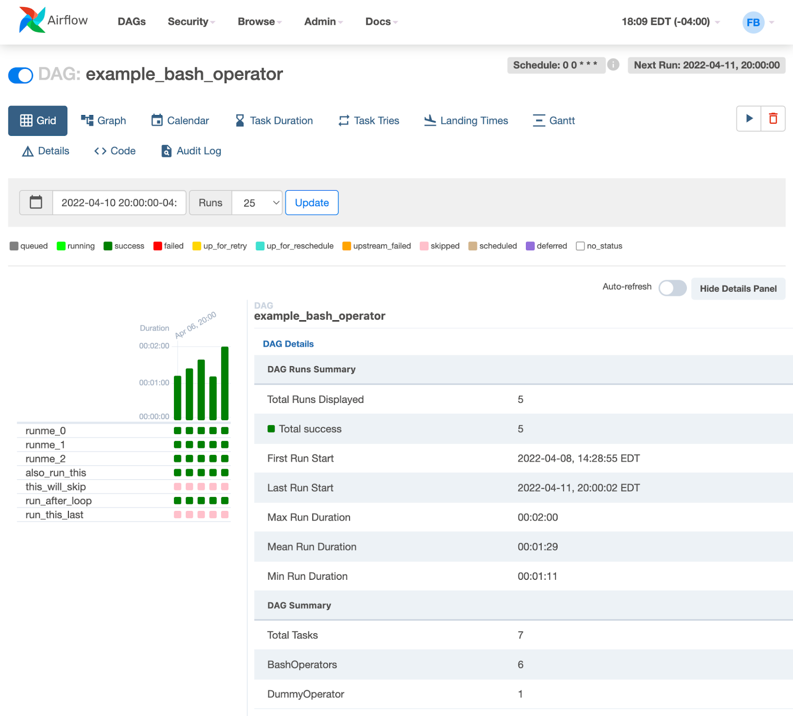
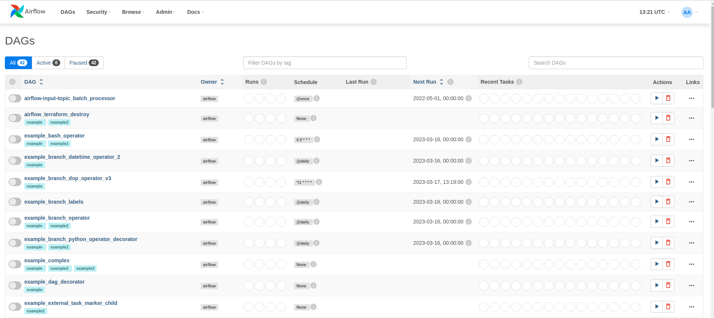
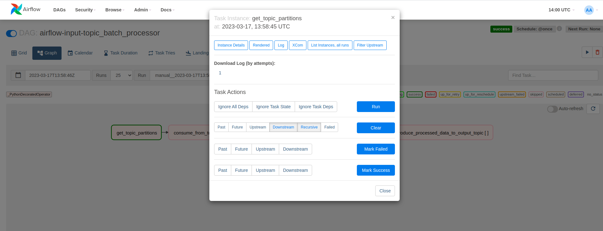

# Kafka batch processing with Airflow

## Introduction

In the world of big data, managing large datasets is crucial. Batch processing is the process of running a large set of data through a particular program or pipeline at one time. In this blog post, we will discuss how Kafka and Airflow can be used for batch processing.

Kafka is a distributed streaming platform which uses logs as the unit of storage for messages passed within the system. Kafka has a unique architecture that allows it to handle high volume data streams in real-time. Event streaming enables real time data interpretation and processing to effect near real time decisions to improve efficiency and optimize costs in businesses. Kafka offers a distributed, highly scalable, elastic, fault-tolerant, and secure infrastructure for real time event streams. Kafka is used in a wide variety of use cases like processing real time transactions in banks, real time analysis of sensor data from IoT devices etc.

Airflow is an open source orchestration tool to manage big data workflows. Workflows are programmatically authored as Directed Acyclic Graphs (DAGs) of tasks. The Airflow scheduler executes your tasks on an array of workers while following the specified dependencies. Airflow pipelines are defined as Python code, which means that anything that you can do with Python you can do with Airflow. It also provides a variety of operators and hooks which helps us to integrate seamlessly with most of the cloud and open-source services. Airflow is designed as a configuration-as-a-code system and it can be heavily customized with plugins.

## ****Why Airflow in Batch processing pipeline?****

Although real time stream processing is used with Kafka mostly, there are a lot of instances where batch processing is required. For example, 

- Online stores might be interested in finding out the hourly or daily aggregate of the number of unique users arriving through a particular advertising channel to optimise their ad spends.
- Banks settling the accumulated bills to vendors at the end of day based on daily transactions.



Airflow is an ideal tool to orchestrate and manage batch processing of logs from Kafka topics as it run on schedules, so the resource usage is significantly lower when compared to Kafka streams or any streaming application. Airflow allows us to decouple big tasks into smaller ones and manage the dependencies between them using DAGs. It also allows us to monitor the status of tasks, re-run or restart tasks from any given point in a workflow in case of failure. Airflow also lets you integrate with tools like Apache Spark etc. to execute the task.

## Kafka consumer partition assignment strategy

In general, Kafka consumers are identified by a consumer group id i.e. all the consumer having the same group id will share the subscribed `TopicPartitions`  among them. When a consumer is added or removed from the group, a consumer re-balance is triggered which completely reassigns `TopicPartitions` among the new set of consumers. There is no guarantee that the consumer-partition mapping will remain the same before and after re-balance. To read about more on the different partition assignment strategies, please visit this [link](https://www.conduktor.io/blog/kafka-partition-assignment-strategy/).

To control the consumer-partition mapping, we need to manually assign a `TopicPartition` to a consumer in the group. This can be achieved by using `consumer.assign()` command. Manual partition assignment can be useful in cases where different processing logic are applied for different partitions, assigning dedicated consumers to heavy throughput partitions etc. In this example, we will use `consumer.assign` to consume from a specific partition, process the data and produce the values to the same output topic partition as input topic. 

## **Airflow Dynamic Task Mapping**

Dynamic task mapping enables us to create parallel tasks in DAG at run time. It facilitates running parallel tasks equal to the number of input Kafka topic partitions. In Kafka, maximum parallelisation is defined by the number of topic partitions. The expand() command is used to dynamically map tasks in Airflow. For more information, visit this [link](https://airflow.apache.org/docs/apache-airflow/2.3.0/concepts/dynamic-task-mapping.html).


We will use manual partition assignment with consumers rather than group based partition assignment. This is to ensure that data can be consumed from an input topic partition, processed and produced to an output topic partition same as the input topic partition in parallel tasks. For the above logic to hold true, the input and output topic should be created with the same number of partitions. Consumer re-balancing in group based partition assignment can lead to mix up while processing data in parallel tasks.

## **Step 1: Download and setup Airflow**

For this tutorial purposes, we will run airflow in docker. For Production, Airflow supports helm charts for Kubernetes deployment. We will be following this [link](https://airflow.apache.org/docs/apache-airflow/stable/start/docker.html) to set up Airflow in docker.

1. Open a terminal window and navigate to the working directory.
    
    ```bash
    cd airflow_kafka
    ```
    
2. Fetch the `docker-compose.yml` file,
    
    ```bash
    curl -LfO   'https://airflow.apache.org/docs/apache-airflow/2.3.2/docker-compose.yaml'
    ```
    
3. Create the required folders for docker compose and set the airflow uid (for Linux),
    
    ```bash
    mkdir -p ./dags ./logs ./plugins ./results
    echo -e "AIRFLOW_UID=$(id -u)" > .env
    ```
    

We have created an extra folder called results to store topic offset locally.

Next, we need Kafka python libraries which are not available in the default airflow image. So, let’s build our custom image with the required dependencies,

1. Create a `requirements.txt` file with the required packages,
    
    ```
    confluent-kafka
    ```
    
2. Create a `Dockerfile` to build custom image,
    
    ```docker
    FROM apache/airflow:2.3.0
    USER root
    RUN apt-get update \
    && apt-get install -y --no-install-recommends \
    	      vim \
    && apt-get autoremove -yqq --purge \
    && apt-get clean \
    && rm -rf /var/lib/apt/lists/*
    USER airflow
    COPY requirements.txt .
    RUN pip install --no-cache-dir -r requirements.txt
    ```
    
3. In `docker-compose.yml`, comment the image option and comment out the build option,
    
    ```yaml
    version: '3'
    x-airflow-common:
      &airflow-common
      # In order to add custom dependencies or upgrade provider packages you can use your extended image.
      # Comment the image line, place your Dockerfile in the directory where you placed the docker-compose.yaml
      # and uncomment the "build" line below, Then run `docker-compose build` to build the images.
      # image: ${AIRFLOW_IMAGE_NAME:-apache/airflow:2.3.0}
      build: .
      environment:
    ......
    ```
    

1. Also, add results to the docker container volumes,
    
    ```yaml
    	volumes:
        - ./dags:/opt/airflow/dags
        - ./logs:/opt/airflow/logs
        - ./plugins:/opt/airflow/plugins
        - ./results:/opt/airflow/results
    ```
    
2. Run database migrations and create the first user account,
    
    ```bash
    docker-compose up airflow-init
    ```
    
3. Now the Airflow is set up and can be started by executing,
    
    ```bash
    docker-compose up -d
    ```
    

Airflow web UI can be accessed at [http://localhost:8080/](http://localhost:8080/)

## **Step 2: Setup the Kafka Server config file**

Before we start writing dags, let’s create the config file to access the input topic in a Kafka cluster. This tutorial assumes you have basic Kafka knowledge and already have an input Kafka topic set up in a remote or local Kafka cluster. Here, we will use an existing topic in the Confluent Cloud as the input topic. The client config file to connect to Kafka cluster will look like the following,

<kafka_server.config>

```
bootstrap.servers=<CLUSTER_LISTENER_URL>:<CLUSTER_LISTENER_PORT>
security.protocol=SASL_SSL
sasl.mechanisms=PLAIN
sasl.username=<CLUSTER_API_KEY>
sasl.password=<CLUSTER_SECRET_KEY>
```

In addition to the above, we can also define producer and consumer specific properties. It would be ideal to have separate config files for producer and consumer. Place the `kafka_server.config` file inside the plugins folder to make it available inside the container.

The input topic here contains the following as message value,

```json
{  
	"datetime": "23/12/2006 16:52:00",
	"voltage": 239.94
}
```

## **Step 3: Define DAG parameters**

Let’s create the `dag.py` inside the /dags folder. Airflow automatically reads dags defined in the /dags folder.

1. Import the required modules,
    
    ```python
    from datetime import datetime, timedelta
    import os
    import pendulum
    import pandas as pd
    import csv
    import json
    from confluent_kafka import Consumer, TopicPartition, Producer
    from confluent_kafka.serialization import StringSerializer
    from confluent_kafka.admin import AdminClient
    from airflow.decorators import dag, task
    ```
    
2. Function to read and parse the config file,
    
    ```python
    def read_ccloud_config(config_file):
    	"""Read Confluent Cloud configuration for librdkafka clients"""
    
    	conf = {}
    	with open(config_file) as fh:
        	for line in fh:
            	line = line.strip()
            	if len(line) != 0 and line[0] != "#":
                	parameter, value = line.strip().split('=', 1)
                	conf[parameter] = value.strip()
    
    	return conf
    ```
    
3. A producer callback function to print the delivered status,
    
    ```python
    delivered_records = 0
    
    # Callback function when a message has been successfully delivered
    def acked(err, msg):
    	global delivered_records
    	"""Delivery report handler called on
    	successful or failed delivery of message
    	"""
    	if err is not None:
        	   print("Failed to deliver message: {}".format(err))
    	else:
        	   delivered_records += 1
        	   print("Produced record to topic {} partition [{}] @ offset {}"
                	   .format(msg.topic(), msg.partition(), msg.offset()))
    ```
    
4. Define the global variables to be used in the dag tasks and the dag configurations. The input values are hard-coded in this example. The input values can be given while triggering the dag as input parameters as well.
    
    ```python
    # Input Values
    topic_config_file = "/opt/airflow/plugins/kafka_server.config"
    topic_name = "airflow-input-topic"
    output_topic_name = "airflow-output-topic"
    # Local file to save latest offsets for topic partitions
    local_offset_file = "/opt/airflow/results/topic-offsets-latest.csv"
    consumer_conf = read_ccloud_config(topic_config_file)
    producer_conf = read_ccloud_config(topic_config_file)
    # Create an empty csv file with headers if not available
    if not os.path.exists(local_offset_file):
    	with open(local_offset_file, "w+") as file:
        	csvwriter = csv.writer(file)
        	csvwriter.writerow(["id", "topic", "partition", "last_offset"])
    
    # Define the DAG configuration for the DAG() function with the @dag decorator, 
    @dag(
    	dag_id="{}_batch_processor".format(topic_name),
    	schedule_interval='@daily',
    	start_date=pendulum.datetime(2022, 5, 1),
    	catchup=False,
    	dagrun_timeout=timedelta(minutes=60),
    )
    def DAG():
    ```
    

The config `catchup=False` is set up to avoid DAG to run missed scheduled runs.

## **Step 4: Fetch partition ids for the given topic**

Let’s start building the DAG by defining each sequential task. All the tasks should be defined inside the `DAG()` function with `@task` decorator.

Initial task is to fetch the partition ids for the given topic,

```python
def DAG():
   @task
   def get_topic_partitions():
    	kadmin = AdminClient(conf)
    	partitions = kadmin.list_topics(topic=topic_name).topics[topic_name].partitions
    	partition_ids = []
    	for partition in partitions:
        	    partition_ids.append(partition)
    	# print(partition_ids)
    	return partition_ids
```

Kafka Admin Client is used to fetch the topic partitions.

## **Step 5: Consume new data for each partition**

Next task is to consume the message for each given topic partition till the latest offset from the previously committed offset.

```python
@task
def consume_from_topic_partition(partition_id):
    	consume_skip = False
      # Transient file to store the consumed messages
    	filename = "/opt/airflow/results/raw/%s_%s.csv" % (topic_name, partition_id)
    	if not os.path.exists(filename):
        	with open(filename, 'a+') as csvfile:
            	csvwriter = csv.writer(csvfile)
            	csvwriter.writerow(["key", "datetime", "voltage", "offset"])
      # Setup consumer related config
    	consumer_conf["auto.offset.reset"] = "earliest"
    	consumer_conf["group.id"] = "airflow-group"
    	consumer = Consumer(consumer_conf)
      
      # Get the earliest and latest offset for a topic partition
    	low, high = consumer.get_watermark_offsets(TopicPartition(topic_name, partition_id))

    	high_offset = high - 1

    	print(high_offset)
      
      # Load the local offset file as dataframe
    	local_offset_db = pd.read_csv(local_offset_file, index_col=[0])

    	last_offset_row = local_offset_db.loc[(local_offset_db["topic"] == topic_name) & (local_offset_db["partition"] == partition_id), ["last_offset"]]

    	if len(last_offset_row) == 0:
            # If the row for the topic partition does not exist, create one.
        	with open(local_offset_file, "a+") as csvfile:
            	csvwriter = csv.writer(csvfile)
            	csvwriter.writerow(["%s_%s" % (topic_name, partition_id) , topic_name, partition_id, 0])
        	consumer.assign([TopicPartition(topic_name, partition_id, low)])
    	else:
        	last_offset_value = last_offset_row["last_offset"].values[0]
        	# Skip consumer if last committed offset is the same as latest offset as now new messages to consume
            if last_offset_value == high_offset:
            	consume_skip = True
        	consumer.assign([TopicPartition(topic_name, partition_id, last_offset_value + 1)])
   	
    	if consume_skip:
        	print("Already consumed till latest offset")
        	consumer.close()
    	else:
        	total_count = 0
        	try:
            	while True:
                	msg = consumer.poll(1.0)
                	if msg is None:
                    	# No message available within timeout.
                    	# Initial message consumption may take up to
                    	# `session.timeout.ms` for the consumer group to
                    	# rebalance and start consuming
                    	print("Waiting for message or event/error in poll()")
                    	continue
                	elif msg.error():
                    	print('error: {}'.format(msg.error()))
                	else:
                    	total_count += 1
                    	value = json.loads(msg.value())
                    	value["datetime"] = datetime.strptime(value["datetime"], "%d/%m/%Y %H:%M:%S")
                    	value["voltage"] = float(value["voltage"])
                    	with open(filename, 'a') as csvfile:
                        	csvwriter = csv.writer(csvfile)
                        	csvwriter.writerow([msg.key(), value["datetime"], value["voltage"], msg.offset()])
                       # Break loop if message offset is the latest offset
                    	if msg.offset() == high_offset:
                        	break
        	except KeyboardInterrupt:
            	pass
        	finally:
            	print(total_count)
            	# Leave group and commit final offsets
            	consumer.close()   	 
    	return partition_id, high_offset
```

## **Step 6: Commit latest offset for each topic partition locally**

Next task is to commit the latest consumed offset to the local offset file. Partition Id and latest offset are taken as input from the previous task. Partition ids are passed to the next task.

```python
@task
def commit_offsets_locally(partition_offset_values):
      partition_ids = []
      local_offset_db = pd.read_csv(local_offset_file, index_col=[0])
      for value in partition_offset_values:
        	print(value)
        	partition_ids.append(value[0])
        	local_offset_db.loc[(local_offset_db["topic"] == topic_name) & (local_offset_db["partition"] == value[0]), "last_offset"] = value[1]
      local_offset_db = local_offset_db.sort_index()
      local_offset_db.to_csv(local_offset_file)
      return partition_ids
```

## **Step 7: Aggregate values for each partition**

Next task is to aggregate the values for the consumed messages. We will calculate the average voltage for each unique date and store them in a transient processed-csv file.

```python
@task
def process_topic_messages(partition_id):
    	messages_db = pd.read_csv("/opt/airflow/results/raw/%s_%s.csv" % (topic_name, partition_id), parse_dates=["datetime"])
    	daily_voltage_avg = messages_db[["datetime", "voltage"]].set_index("datetime").groupby(pd.Grouper(freq='D')).mean().reset_index()
    	daily_voltage_avg.columns = ["date", "avg_voltage"]
      # Store in a transient processed file
    	daily_voltage_avg.to_csv("/opt/airflow/results/processed/%s_%s.csv" % (topic_name, partition_id))
    	return partition_id
```

## **Step 8: Produce aggregated value to output topic**

Next task is to produce the aggregated values to the output topic. Date wise average voltage values are produced to the same partition as the input topic. So, the input and output topics are co-partitioned.

```python
@task
def produce_processed_data_to_output_topic(partition_id):
      # Add producer related configuration
    	producer_conf['key.serializer'] = StringSerializer('utf-8')
    	producer_conf['value.serializer'] = StringSerializer('utf-8')
    	p = Producer(producer_conf)
    	with open("/opt/airflow/results/processed/%s_%s.csv" % (topic_name, partition_id), 'r') as file:
        	reader = csv.reader(file)
        	for row in reader:
            	if 'date' in row:
                		continue
            	p.poll(0)
            	record_key = row[1]
            	record_value = json.dumps({"date": str(row[1]), "voltage": row[2]})
            	p.produce(output_topic_name, key=record_key, value=record_value, partition=partition_id, on_delivery=acked)
        	p.flush()
    	return "Finished producing"
```

## **Step 9: Define the task flow for the DAG**

Next step is to connect the defined tasks in the appropriate order for the dag to execute. The `expand()` command is used to execute tasks in parallel and simultaneously.

```python
partitions_latest_offset_list = consume_from_topic_partition.expand(partition_id=get_topic_partitions())
partitions_list = commit_offsets_locally(partitions_latest_offset_list)
partitions_list = process_topic_messages.expand(partition_id=partitions_list)
produce_processed_data_to_output_topic.expand(partition_id=partitions_list)
```

Finally, call the `DAG()` function to execute the dag.

```python
dag = DAG()
```

Executing the dag does not trigger the dag. A dag is triggered based on the defined schedule and can also be triggered manually in web UI and rest API endpoint.

Now, run the `docker-compose up -d`  command and head to the link [http://localhost:8080](http://localhost:8080/)/.

Default username and password for the airflow web UI are,

```
Username: airflow
Password: airflow
```

Once you log in, you should be able to see the defined DAG in the web UI which should have the same name as the dag_id we defined in the DAG configuration.



We can now trigger the **`airflow-input-topic_batch_processor`** by clicking the play button under the `Actions` section.

We can track the dag status in Graph or Grid mode in the dag page. Also, we can see the Logs, XCom etc. for each dag task like below.



## **Conclusion**

In this tutorial, we were able to do the following,

1. Build custom Airflow docker image with required python dependencies.
2. Run Airflow in docker compose with a custom docker image.
3. Dynamic task mapping in Airflow to run parallel tasks.
4. Produce to and consume from a Kafka topic per partition.
5. Input and Output Kafka topics are co-partitioned.

In conclusion, Kafka and Airflow are two of the most popular open-source tools that are used for batch processing. Kafka is designed to handle high-volume data streams in real-time, while Airflow is designed to orchestrate complex workflows and data processing pipelines. Using Kafka and Airflow together can provide a scalable and fault-tolerant solution for batch processing large datasets.

### **References**

1. [https://airflow.apache.org/docs/apache-airflow/2.3.0/start/docker.html](https://airflow.apache.org/docs/apache-airflow/2.3.0/start/docker.html)
2. [https://airflow.apache.org/docs/apache-airflow/2.3.0/concepts/dynamic-task-mapping.html](https://airflow.apache.org/docs/apache-airflow/2.3.0/concepts/dynamic-task-mapping.html)
3. [https://airflow.apache.org/docs/docker-stack/build.html](https://airflow.apache.org/docs/docker-stack/build.html)
4. [https://github.com/confluentinc/examples/tree/7.1.0-post/clients/cloud/python](https://github.com/confluentinc/examples/tree/7.1.0-post/clients/cloud/python)