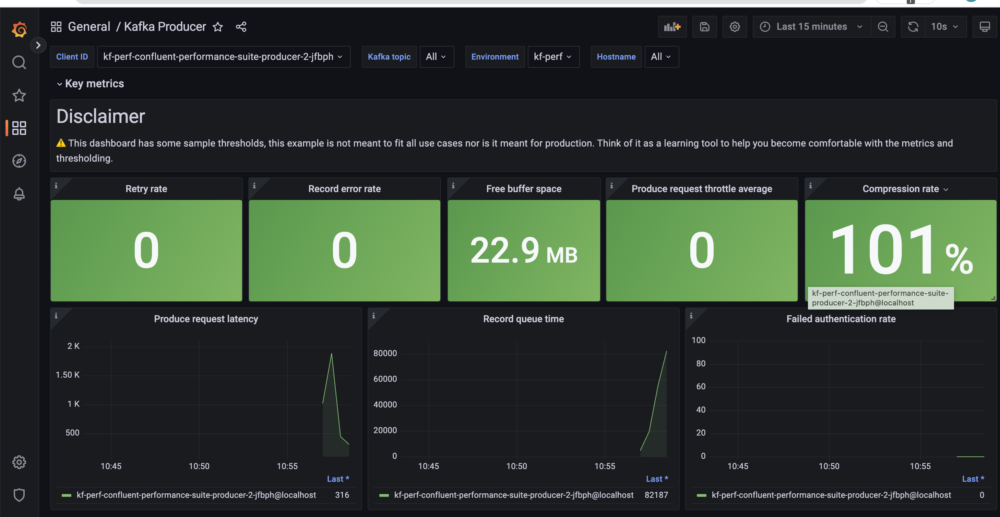
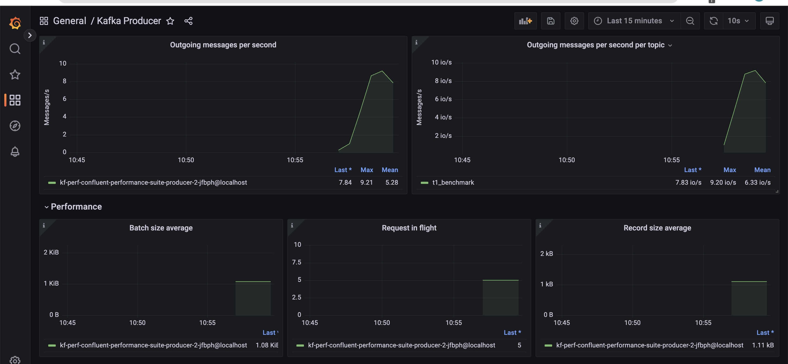
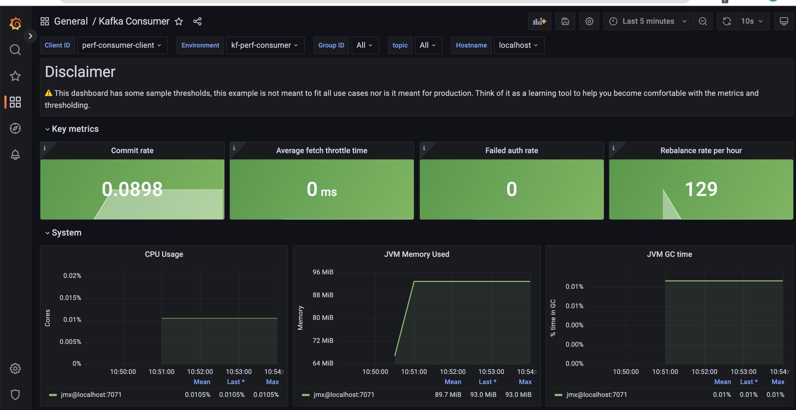
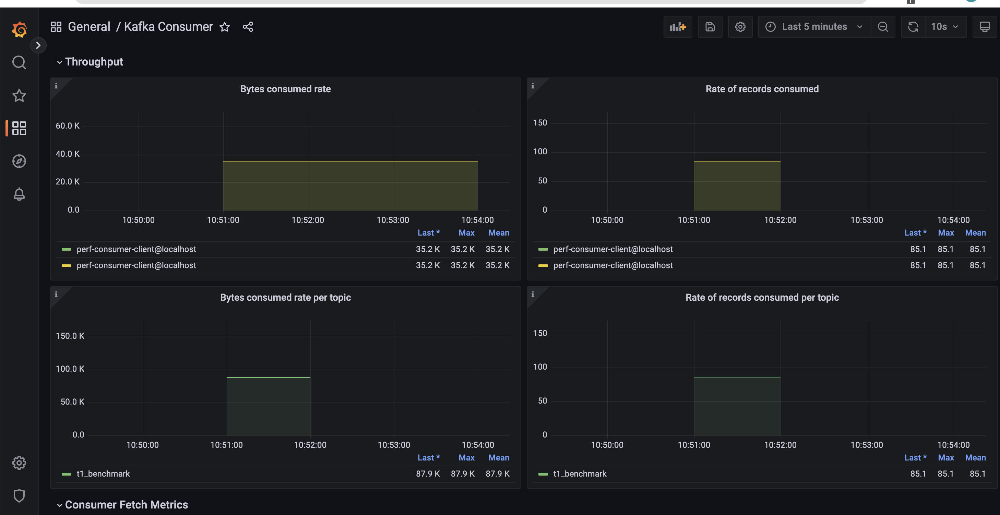
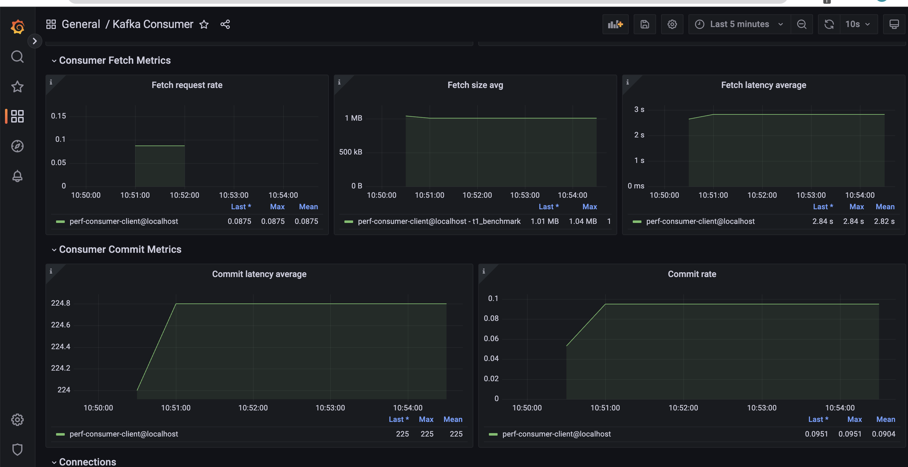

There are numerous parameters we have to consider tweaking when benchmarking a Kafka cluster. Irrespective of these parameters, we optimize along the following dimensions:

1. Throughput: The volume of data moved across the cluster in a given unit of time.
2. Durability: Are we minimizing the chance of messages getting lost
3. Availability: How quickly can my Kafka cluster recover from a failure scenario and be operational again?
4. Latency: How soon can a message be consumed after it is produced?

## Defining our problem statement

The purpose of a Kafka benchmarking exercise is to initially establish baseline performance characteristics, mainly for throughput and end to end latency. We then iteratively optimize these quantities by modifying various producer and consumer parameters, running the benchmark again, measuring the quantities. These steps are done in a “rinse and repeat” fashion till we hit our desired performance metrics.

There are quite a few performance testing frameworks in the open which aid in doing this. We prepare a wishlist of items required for a good benchmarking system, like:

1. It should be close to a realistic production scenario. No toy benchmarking.
2. Ability to snapshot and visualize the data from various test runs.
3. Ease of setup. The benchmarking system itself shouldn’t be complicated to setup with a lot of configuration landmines. Nothing is more dangerous than a misconfigured benchmarking system which gives us false promises.

Let’s see how existing setups measure up against this wishlist.

## Openmessaging benchmarks

The [Openmessaging benchmark framework](https://openmessaging.cloud/docs/benchmarks/) is a vendor-neutral suite of tools which eases benchmarking of distributed benchmarking systems. In addition to Kafka, this framework provides benchmarking tools for other messaging systems like RabbitMQ and Apache Pulsar.
In essence, Openmessaging benchmarking involves the following steps broadly:

1. Spin up the infrastructure needed to run Kafka in the cloud using Terraform
2. Provision and install Kafka clusters and clients using Ansible playbook
3. Run benchmarks from client hosts. NOTE that this can be run in a distributed manner as well across multiple hosts.

One of the biggest selling points of Openmessaging benchmarks is that they are as close to realistic scenarios as possible. In fact, this is one of the stated goals of the project. There is also the provision to download the metrics data for each test run/scenario.

We observed a few shortcomings with Openmessaging benchmarks.

1. The inability to measure end to end latency. This is a key metric in many scenarios and there is no documented way to measure this in Openmessaging suite.
2. Ease of setup. Openmessaging provides all the necessary scaffold scripts like Terraform and Ansible to run the test. This could be made easier. There is an option to deploy it as a [Helm chart](https://github.com/openmessaging/benchmark/blob/master/deployment/kubernetes/helm/README.md), which closely resembles our approach as well. But this isn’t documented.
3. As a sub-idea of 2, we don’t have an easy way to visualize these numbers. We all love to see the big picture instead of staring at a spreadsheet full of numbers. It would be great if we can pipe the output straight to tools like Grafana.

## Apache Trogdor

[Apache Trogdor](https://github.com/apache/kafka/tree/trunk/trogdor) is a test framework for Kafka. Although it does excellent performance testing, Trogdor emphasizes a lot of [fault testing](https://cwiki.apache.org/confluence/display/KAFKA/Fault+Injection). The idea is to run a Trogdor agent in every cluster node and a Trogdor coordinator daemon which manages the agents and tasks in the cluster. The agent can simulate a fault by crashing one of the brokers. We measure the message durability, adjust the parameters and re-run the process again. Confluent cloud [uses Trogdor](https://www.confluent.io/blog/cloud-kafka-as-a-service/) to performance test its infrastructure.

Again, we found the following things lacking in Trogdor.

1. No way to measure end to end latency. The [RoundTripWorkload](https://github.com/apache/kafka/tree/trunk/trogdor#roundtripworkload) is a close match for what we were looking for, but doesn’t quite cut it.
2. It doesn’t emit metrics which can be visualized. There is a provision to show the status of a submitted task. This gives a snapshot of the task(a task is a specific, defined benchmark scenario), like time taken, number of messages sent, 99th percentile latency etc.
3. We have to run the agent and coordinator daemon processes in the cluster. Sometimes, due to various limitations, we might not be able to do so.

## Jmeter

Jmeter is an excellent tool to benchmark Kafka clusters and scores pretty high on the “ease of setup” factor. [PepperBox](https://pepperbox.gslab.com/), a specialized Kafka load generator for Jmeter, is a prerequisite for running load tests using Jmeter. However, Jmeter suffers from the following limitations:

1. We have to write the consumer client code for running the end to end tests.
2. There is no way to measure the latency. We had to tweak the consumer to write the timestamp to a file. Ideally, there should be a complementing tool for PepperBox at the consumer end for this.

## Kafka perf tools

Kafka offers a set of performance testing tools for the producer, consumer and also to measure end to end latency. This is the least common denominator of all the tools out there which fits our bill, but we’re not quite out there yet. We don’t have the option to load test a production replica scenario(Ex. Parallel producers/consumers). There’s also the “ease of setup” factor missing. We have to clean up the resources and re-run the process for a new scenario. Finally, there is no way to record and view the metrics. We will build a Prometheus based scaffold to send these metrics. In the rest of the post, we shall focus on how we’ve fixed these issues and created a robust and reliable performance testing framework which fulfills our wishlist.

## Prerequisites

You should have a Kafka cluster which needs to be benchmarked(Duh!). Arguably the fastest way to get your hands on a fairly production ready Kafka cluster is to sign up for a Confluent cloud account and spin up a new cluster.

## Benchmarking using kafka provided tools
For those of you who are new to benchmarking using Kafka perf-tools, here’s a brief recap.
First, you create a new topic where you want to send your records.

```bash
$ kafka-topics \ # <-------- (1)
  --if-not-exists \
  --topic mytopic  \ # <-------- (2)
  --create \
  --bootstrap-server xxx-yyyy.us-west4.gcp.confluent.cloud:9092 \ # <-------- (3)
  --replication-factor 3  \ # <-------- (4)
  --partitions 1 \ # <-------- (5)
  --command-config kafka.properties  # <-------- (6)
```

1. `kafka-topics` is the CLI tool which ships with [Apache Kafka](https://kafka.apache.org/downloads)(as `kafka-topics.sh`) and [confluent platform package](https://docs.confluent.io/platform/current/installation/installing_cp/zip-tar.html#prod-kafka-cli-install).
2. Name of the topic you want to create
3. The bootstrap server URL. You get this from your confluent cloud account.
4. Replication factor for your topic. Please update it with your desired replication factor.
5. The number of partitions for the topic. Again, update it to suit your needs
6. The `kafka.properties` file, needed for all the CLI tools we will run.

Let’s quickly take a look at the contents of kafka.properties.

```
bootstrap.servers=xxx-yyyy.us-west4.gcp.confluent.cloud:9092 # <-- (1)
security.protocol=SASL_SSL # <-- (2)
sasl.jaas.config=org.apache.kafka.common.security.plain.PlainLoginModule   required username='BADRI123SZK5QZJI'   password='Supersecretlongpasswordgivenbyconfluentcloud';  # <-- (3)
sasl.mechanism=PLAIN # <-- (4)
```

1. The bootstrap server URL, which you can obtain from confluent cloud.
2. Confluent cloud uses SASL_SSL for authentication.
3. The user name and password can be obtained from confluent cloud.

**NOTE** that this properties file will be used across the board for the producer and consumer benchmark tools as well.

Time to pump in some messages to this topic.

```bash
$ kafka-producer-perf-test \ # <-- (1)
  --topic mytopic  \ # <-- (2)
  --num-records 10000 \ # <-- (3)
  --record-size 1024 \ # <-- (4)
  --throughput -1 \ # <-- (5)
  --producer-props acks=all client.id=producer-01 \ # <-- (6)
  --producer.config kafka.properties
  --print-metrics # < -- (7)
```

1. We run the `kafka-producer-perf-test` CLI tool for this.
2. We send messages to the topic we created just now.
3. We’re sending 10k records.
4. The size of each of these records is 1024 bytes.
5. We don’t want to throttle the number of messages per second. Hence, we set it to -1.
6. Number of acknowledgements the leader broker must have received before acknowledging to the producer. We also specify the client ID here.
7. Print the producer metrics.

We should get an output which looks similar to this.

```
1 records sent, 0.2 records/sec (0.00 MB/sec), 5289.0 ms avg latency, 5289.0 ms max latency.
1215 records sent, 240.6 records/sec (0.24 MB/sec), 4727.5 ms avg latency, 7196.0 ms max latency.
1275 records sent, 246.3 records/sec (0.24 MB/sec), 9746.1 ms avg latency, 12365.0 ms max latency.
1500 records sent, 269.5 records/sec (0.26 MB/sec), 14727.0 ms avg latency, 17925.0 ms max latency.
1425 records sent, 283.6 records/sec (0.28 MB/sec), 20428.6 ms avg latency, 22947.0 ms max latency.
1650 records sent, 320.0 records/sec (0.31 MB/sec), 25312.8 ms avg latency, 28097.0 ms max latency.
1200 records sent, 238.0 records/sec (0.23 MB/sec), 30665.2 ms avg latency, 33137.0 ms max latency.
1200 records sent, 212.7 records/sec (0.21 MB/sec), 35153.8 ms avg latency, 38780.0 ms max latency.
10000 records sent, 223.613596 records/sec (0.22 MB/sec), 21165.35 ms avg latency, 41544.00 ms max latency, 21647 ms 50th, 38785 ms 95th, 40823 ms 99th, 41544 ms 99.9th.

Metric Name                                                                                                           Value
app-info:commit-id:{client-id=producer-1}                                                                           : 06652ad189d0cbf0
app-info:start-time-ms:{client-id=producer-1}                                                                       : 1653549654259
app-info:version:{client-id=producer-1}                                                                             : 6.2.1-ce
kafka-metrics-count:count:{client-id=producer-1}                                                                    : 113.000
producer-metrics:batch-size-avg:{client-id=producer-1}                                                              : 15548.256
producer-metrics:batch-size-max:{client-id=producer-1}                                                              : 15556.000
producer-metrics:batch-split-rate:{client-id=producer-1}                                                            : 0.000
producer-metrics:batch-split-total:{client-id=producer-1}                                                           : 0.000
producer-metrics:buffer-available-bytes:{client-id=producer-1}                                                      : 33554432.000

...
producer-topic-metrics:record-error-total:{client-id=producer-1, topic=mytopic}                                     : 0.000
producer-topic-metrics:record-retry-rate:{client-id=producer-1, topic=mytopic}                                      : 0.000
producer-topic-metrics:record-retry-total:{client-id=producer-1, topic=mytopic}                                     : 0.000
producer-topic-metrics:record-send-rate:{client-id=producer-1, topic=mytopic}                                       : 250.752
producer-topic-metrics:record-send-total:{client-id=producer-1, topic=mytopic}                                      : 10000.000
```

Let’s consume the messages we created.

```bash
$ kafka-consumer-perf-test \
  --topic mytopic  \ # <-- (1)
  --bootstrap-server xxx-yyyy.us-west4.gcp.confluent.cloud:9092 \ # <-- (2)
  --messages 1000 \  # <-- (3)
  --consumer.config kafka.properties  # <-- (4)
  --print-metrics \
  --timeout=100000  # <-- (5)
  ```

1. We use the same topic.
2. We have to specify the bootstrap server.
3. The number of messages we want to consume.
4. We refer to the same kafka.properties file.
5. The amount of time the consumer process waits before the broker returns records.


Here’s a sample output from a consumer perf test run.

```
start.time, end.time, data.consumed.in.MB, MB.sec, data.consumed.in.nMsg, nMsg.sec, rebalance.time.ms, fetch.time.ms, fetch.MB.sec, fetch.nMsg.sec
2023-03-30 13:18:56:066, 2023-03-30 13:19:11:826, 0.9766, 0.0620, 1000, 63.4518, 6219, 9541, 0.1024, 104.8108

Metric Name                                                                                                                    Value
consumer-coordinator-metrics:assigned-partitions:{client-id=consumer-perf-consumer-24667-1}                                  : 0.000
consumer-coordinator-metrics:commit-latency-avg:{client-id=consumer-perf-consumer-24667-1}                                   : 218.500
consumer-coordinator-metrics:commit-latency-max:{client-id=consumer-perf-consumer-24667-1}                                   : 222.000
consumer-coordinator-metrics:commit-rate:{client-id=consumer-perf-consumer-24667-1}                                          : 0.057
consumer-coordinator-metrics:commit-total:{client-id=consumer-perf-consumer-24667-1}                                         : 2.000
consumer-coordinator-metrics:failed-rebalance-rate-per-hour:{client-id=consumer-perf-consumer-24667-1}                       : 88.703
consumer-coordinator-metrics:failed-rebalance-total:{client-id=consumer-perf-consumer-24667-1}                               : 1.000
consumer-coordinator-metrics:heartbeat-rate:{client-id=consumer-perf-consumer-24667-1}                                       : 0.081

...
consumer-fetch-manager-metrics:records-lag-max:{client-id=consumer-perf-consumer-24667-1}                                    : 41500.000
consumer-fetch-manager-metrics:records-lag:{client-id=consumer-perf-consumer-24667-1, topic=mytopic, partition=0}            : 41000.000
consumer-fetch-manager-metrics:records-lead-avg:{client-id=consumer-perf-consumer-24667-1, topic=mytopic, partition=0}       : 750.000
consumer-fetch-manager-metrics:records-lead-min:{client-id=consumer-perf-consumer-24667-1, topic=mytopic, partition=0}       : 500.000
consumer-fetch-manager-metrics:records-lead-min:{client-id=consumer-perf-consumer-24667-1}                                   : 500.000
consumer-fetch-manager-metrics:records-lead:{client-id=consumer-perf-consumer-24667-1, topic=mytopic, partition=0}           : 1000.000
consumer-fetch-manager-metrics:records-per-request-avg:{client-id=consumer-perf-consumer-24667-1, topic=mytopic}             : 1000.000
consumer-fetch-manager-metrics:records-per-request-avg:{client-id=consumer-perf-consumer-24667-1}                            : 1000.000
kafka-metrics-count:count:{client-id=consumer-perf-consumer-24667-1}                                                         : 61.000
```
The typical way to run Kafka benchmarks is to take a set of parameters for the producer and consumer, do a set of sample runs with those parameters, and record the metrics we get. We repeat this loop until we get the desired numbers. This can be likened to an OODA (Observe Orient Decide Act) loop, where the mapping looks like this:

- Observe - Look at the printed metrics for each run.
- Orient - Find out what configuration tweak led to this set of outcomes.
- Decide - Figure what configuration parameters to change for next run.
- Act - Run the benchmarks CLI program.

Applying the OODA loop to the plain vanilla kafka benchmark CLI tools can get messy quickly. For instance, what should I be doing to run 20 parallel producers? Also, how can I move all these metrics to a central location for later analysis/charting?
What numbers did we get the last time we ran for a particular set of config values?

We fix these open questions in the rest of the post.

## Take 2 - Kubernetes

One major change in our benchmarking procedure will be the fact that we will move all our benchmark CLI tools to Kubernetes services. So, the prerequisite here would be for you to have a working Kubernetes cluster with the kubectl client.

Let’s try running this as a Kubernetes Job.

```yaml
apiVersion: batch/v1
kind: Job
metadata:
  name: producer # <-------- (1)
  labels:
    type: producer
spec:
  completions: 3 # <-------- (2)
  parallelism: 3
  template:
    spec:
      initContainers: # <-------- (3)
      - name: topics
        image: confluentinc/cp-kafka:7.3.2  # <-------- (4)
        command:
        - /bin/sh
        - -c
        - |
          kafka-topics \
            --if-not-exists \
            --topic mytopic  \
            --create \
            --bootstrap-server xxx-yyyy.us-west4.gcp.confluent.cloud:9092 \
            --replication-factor 3  \
            --partitions 1  \
            --command-config /mnt/kafka.properties
        volumeMounts:
        - name: kafka-properties # <-------- (5)
          mountPath: /mnt
      containers:
      - name: producer
        image: confluentinc/cp-kafka:7.3.2
        command:
        - /bin/sh
        - -c
        - |
          kafka-producer-perf-test \ # <-------- (6)
          --topic perf-test \
          --num-records 10000 \
          --record-size 1024 \
          --throughput -1 \
          --producer-props acks=1 client.id=foo  batch.size=1000 linger.ms=100 compression.type=lz4 \
          --producer.config /mnt/kafka.properties
        volumeMounts:
        - name: kafka-properties
          mountPath: /mnt
      volumes:
        - name: kafka-properties
          secret:
            secretName: "kafka-client-config"
      restartPolicy: Never
  backoffLimit: 4
```

1. We run a job called "producer".
2. Indicates the number of parallel producer jobs we want to run.
3. We run an initcontainer which creates the topic if it doesn’t exist.
4. The latest confluent kafka container image at the time of writing this. Please substitute with a more recent image if applicable.
5. We model the `kafka.properties` as a kubernetes secret and mount it here as a volume.
6. We run the actual producer perf test process with all the parameters.

Now, we can run this in a Kubernetes cluster and get the same OODA loop running. But what changed, other than moving everything inside containers? For starters, we can parallelize the process simply by increasing the `parallelism` spec of the job.

Also, we can ship these metrics to Prometheus if we bake the kafka container image with a JMX agent.

```Dockerfile
FROM confluentinc/cp-kafka:7.3.2 # <---------- (1)

COPY jmx /usr/app # <---------- (2)
# Install Prometheus
RUN curl -s https://api.github.com/repos/prometheus/prometheus/releases/latest \
  | grep browser_download_url \
  | grep linux-amd64 \
  | cut -d '"' -f 4 \
  | wget -qi - && \
  tar xf prometheus*.tar.gz && \
  cd prometheus*/ && \
  mv prometheus .. # <---------- (3)
```

1. We start with the official Confluent Kafka base image.
2. We copy over the JMX agent jar and corresponding YAML configuration file tailored for Kafka.
3. We install Prometheus binary.

Prometheus is typically configured for pull based metrics. In our case, we run the prometheus binary in a push-based fashion. We have a JMX server running in port `7071` for the duration of the Job. We configure Prometheus to run in agent mode, where it will fetch metrics from the JMX server and push to a pre-configured write endpoint in the Prometheus server.

```bash
./prometheus --enable-feature=agent --config.file="/prom/prometheus.yml" --log.level=error
```

Let's take a quick look at the prometheus agent configuration.

```yaml
# my global config
global:
  scrape_interval: 15s # Set the scrape interval to every 15 seconds. Default is every 1 minute.
  evaluation_interval: 15s # Evaluate rules every 15 seconds. The default is every 1 minute.
  # scrape_timeout is set to the global default (10s).


# A scrape configuration containing exactly one endpoint to scrape:
# Here it's Prometheus itself.
scrape_configs:
  # The job name is added as a label `job=<job_name>` to any timeseries scraped from this config.
  - job_name: "jmx"  # <---- (1)

    # metrics_path defaults to '/metrics'
    # scheme defaults to 'http'.

    static_configs:
      - targets: ["localhost:7071"] # <---- (2)
        labels:
          env: 'dev'  # <---- (3)
    relabel_configs:
      - source_labels: [__address__]
        target_label: hostname
        regex: '([^:]+)(:[0-9]+)?'
        replacement: '${1}'
remote_write:
  - url: 'http://your-prometheus-url/api/v1/write'  # <---- (4)
```

1. Name of the prometheus Job.
2. The target from which we scrape the metrics.
3. A unique identifier for every run.
4. The Prometheus server url to write the metrics to.

**NOTE** that the Prometheus server should have "remote write receiver" [enabled](https://prometheus.io/docs/prometheus/latest/feature_flags/#remote-write-receiver) for the prometheus agent to send JMX metrics.

I’d argue that we didn’t gain much from this transition, except for the Prometheus integration. I still have to change the config parameters for the next run, kubectl apply it, and track the metrics. We can do better. We could run a Helm chart with a parameterized set of input values and ship off these metrics to Prometheus. Before we go into the details of the Helm chart, let's define how a typical testing loop looks like.

1. Come up with a baseline test on standard hardware / test conditions
2. Identify specific scenarios (these translate into producer and consumer configs)
3. Configure accordingly and run the test
4. Look at the client "blackbox" profile for throughput, latency
5. Look at the client "whitebox" profile - extended JMX metrics
6. Look at the server-side "blackbox" profile - throughput, latency
7. Look at the server-side "whitebox" profile - extended JMX metrics
8. Look at the log levels both client and server side - if needed, increase it to look at specific problems, if any

Repeat-rinse steps 3 - 8 and infer performance based on deviation from the baseline.


## Take 3 - Helm chart
We take the following artifacts,

1. The kafka.config secret
2. Producer perf test job
3. Consumer perf test job
4. Prometheus config

And templatize them, package them as a Helm chart. We model every iteration in our OODA loop as a new helm release with its own set of helm values.

The Helm chart does the following:
1. Run a distributed set of producer jobs(defined by the `producer.count` parameter)
2. run a distributed consumer - simplest is to have an array of consumers (and topics) defined so we don't get into managing concurrency; instead, we just create `consumer.count` number of consumer Jobs to paralelly consume from the topic.

**Note** that we will need the consumer to run with a countdown latch or timeout.

Here’s a performance test release with values optimized for throughput.

```yaml
topic:
  name: "t1_benchmark"
  replicationFactor: 3
  partitions: 1

broker:
  url: "xxx-yyyy.us-west4.gcp.confluent.cloud:9092"
  username: "XXXXX"
  password: "YXYXYXYXY2341234wesfdf345234"

producer:
  enabled: true
  image: "confluentinc/cp-kafka:7.3.2"
  recordsCount: 1000
  recordSizeBytes: 1024
  throughput: "-1"
  acks: 1
  count: 3
  params: "batch.size=100000 linger.ms=100 compression.type=lz4"

consumer:
  enabled: true
  image: "confluentinc/cp-kafka:7.3.2"
  messagesCount: 1000
  count: 1
  timeout: 100000
  ```

And here’s another set of values optimized for high durability.

```yaml
topic:
  name: "t1_benchmark"
  replicationFactor: 3
  partitions: 1

broker:
  url: "xxx-yyyy.us-west4.gcp.confluent.cloud:9092"
  username: "XXXXX"
  password: "YXYXYXYXY2341234wesfdf345234"

producer:
  enabled: true
  image: "confluentinc/cp-kafka:7.3.2"
  recordsCount: 1000
  recordSizeBytes: 1024
  throughput: "-1"
  acks: "all"
  count: 3
  params: "enable.idempotence=true max.in.flight.requests.per.connection=1"

consumer:
  enabled: true
  image: "confluentinc/cp-kafka:7.3.2"
  messagesCount: 1000
  count: 1
  timeout: 100000
```

### A quick aside on Prometheus and Grafana

The code accompanying this post ships with a custom Helm chart which piggy backs on the [Kube Prometheus stack](https://github.com/prometheus-community/helm-charts/tree/main/charts/kube-prometheus-stack) to install Prometheus, Grafana and a couple of associated producer and consumer dashboards. This chart will also wire Prometheus as a datasource for the Grafana installation.

You can install this setup using the following command.

```bash
helm upgrade --install prom-stack ./kube-prometheus-kafka-chart
```

The Prometheus console can be viewed in the browser by issuing a port-forward command.

```bash
 kubectl port-forward svc/prometheus-operated 9090:9090
 ```

We can do something similar for the Grafana web console as well.

```bash
kubectl port-forward svc/prom-stack-grafana 8080:80
```

Grafana requires credentials, which are `admin` and `platformatory`(the default password in the Helm chart).

### Running the performance tests

Once we have the scaffold ready, we run a helm release using the following command,

```bash
helm upgrade --install march-25-2023-durability-producer ./kafka-performance-metrics-chart  --values durability-producer-values.yml
```

This is how a typical producer dashboard would look like.






Next, we run the corresponding consumer job using the Helm chart.







```bash
helm upgrade --install march-25-2023-durability-consumer ./kafka-performance-metrics-chart  --values durability-consumer-values.yml
```

...and process the consumer dashboard.

### Shipping metrics to other systems

The performance metrics Helm chart has provision to write openmetrics to any system which supports the Prometheus remote write feature. This configuration can be changed in the `values.yaml` as illustrated below:

```yaml
prometheus:
  remote_write:
  - url: "http://prom-stack-kube-prometheus-prometheus:9090/api/v1/write"
```

As a quick example, if you want to use New Relic to process the metrics, your configuration would look like this:

```yaml
prometheus:
  remote_write:
  - url: https://metric-api.newrelic.com/prometheus/v1/write?prometheus_server=kafka-perf-test
    bearer_token: xxxxxxxxxxxxxxxxxxxxxxxxxxx
```

The Helm charts and the associated code mentioned in this post can be found [here](https://github.com/Platformatory/kafka-performance-suite).
