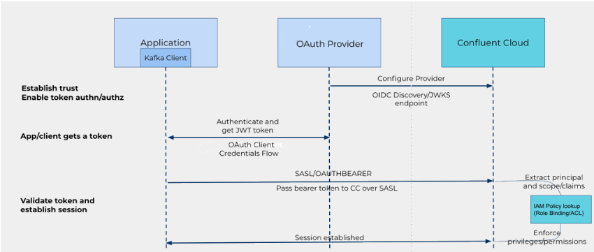

# **OAuth2: What You Need to Know?**


In the digital age, securing access to sensitive data and resources is paramount. Traditional authentication methods often require users to share their long-term credentials with third-party applications, posing significant security risks. Enter OAuth 2.0, a powerful authorization framework designed to address these concerns by allowing users to grant third-party websites or applications access to their protected resources without revealing their long-term credentials or identity.

OAuth 2.0 introduces an innovative authorization layer that separates the role of the client (the application requesting access) from the resource owner (the user). In this framework, the client requests access to resources controlled by the resource owner and hosted by the resource server. Instead of using the resource owner's credentials, the client is issued an Access Token— a string that defines the specific scope, lifetime, and other access attributes. This token is issued by an authorization server with the user's approval, enabling the client to access the protected resources on the resource server securely.

Platforms like Auth0 further enhance this process by generating access tokens in JSON Web Token (JWT) format for API authorization scenarios. The permissions associated with these access tokens, known as scopes, define the level of access granted to the application. When an application authenticates with Auth0, it specifies the desired scopes. If these scopes are authorized by the user, the access token will represent these authorized permissions, ensuring secure and granular access control.

In this blog post, we will discuss how configuring identity providers on Confluent Cloud allows you to manage application access without depending on user accounts. This section covers various aspects of configuring and managing identity providers for OAuth/OIDC.

# **Pros and Cons of Using OAuth**

## **Pros:**

**Security:**

- Reduces the risk associated with sharing long-term credentials.
- Limits the access granted to third-party applications, minimizing potential damage from compromised tokens.

**Granular Access Control:**

- Users can grant specific permissions (scopes) to third-party applications.
- Tokens can have limited lifetimes and scopes, offering fine-grained control over access.

**User Experience:**

- Simplifies the process of granting access to third-party applications.
- Users authenticate with a trusted authorization server, improving confidence in the security of their credentials.

## **Cons:**

**Complexity:**

- Setting up OAuth can be complex, especially if you’re not familiar with it.
- The configuration involves multiple components such as authorization servers, scopes, tokens, and client credentials, which can be challenging to manage without prior experience.

**Dependency:**

- OAuth relies on an identity provider for authentication.
- This dependency introduces additional points of failure. If the identity provider experiences downtime or issues, it can affect the entire authentication flow. This identity provider could be any service, not necessarily Okta, and the reliance on this external service adds a layer of dependency that needs to be managed carefully.

## **When to Use OAuth**

- When you need secure, token-based authentication.
- If you are using Confluent Cloud in an enterprise setting where centralized identity management is important.
- When you need to integrate with other systems that support OAuth.

# Summary of the steps in the OAuth 2.0 flow:

Confluent OAuth uses the OAuth 2.0 protocol for authentication and authorization. OAuth is a widely-used standard that provides temporary access tokens to clients. These tokens allow clients to access and use Confluent Cloud resources and data on behalf of a user or application.



## 1. Establish Trust Between Confluent and Your Identity Provider

**Add the Identity Provider:**

- Ensure that the identity provider (e.g., Okta) is registered with Confluent Cloud. This usually involves providing some configuration details to Confluent Cloud.

**Define the Type of Identity Provider:**

- Specify whether the identity provider is OAuth 2.0 or OIDC (OpenID Connect). Each provider might have specific requirements for integration.

**Create a Trust Relationship:**

- This involves configuring Confluent Cloud to trust tokens issued by your identity provider. You might need to upload or specify the public keys or JWKS (JSON Web Key Set) URL from your identity provider.

**Add Claims for Authentication and Authorization:**

- Define which claims from the JWT will be used for authentication and authorization. Common claims include `sub` (subject), `aud` (audience), and custom claims like user roles or groups.

## **2. Configure Your Identity Pool and Access Policy**

**Identity Pool:**

- Create an identity pool in Confluent Cloud, which groups external identities and assigns them access based on policies. You might need to configure mappings to ensure the correct access levels.

**Access Policy:**

- Define what resources the identities in the pool can access and what actions they can perform.

## **3. Configure Clients**

**Client ID and Client Secret:**

- Obtain these from your identity provider. They are used to authenticate the client (Kafka producer/consumer) with the identity provider.

**Client Credentials Grant:**

- The client uses the Client ID and Client Secret to request an access token (JWT) from the identity provider.

**Producer/Consumer Configuration Example:**

Use the following Kafka client settings for OAuth 2.0 authentication:

```
log4j.logger.org.apache.kafka=TRACE
bootstrap.servers=pkc-p11xm.us-east-1.aws.confluent.cloud:9092
security.protocol=SASL_SSL
sasl.oauthbearer.token.endpoint.url=https://trial-6662742.okta.com/oauth2/aush040p2xDZzZHcu697/v1/token
sasl.login.callback.handler.class=org.apache.kafka.common.security.oauthbearer.secured.OAuthBearerLoginCallbackHandler
sasl.mechanism=OAUTHBEARER
sasl.jaas.config= \
  org.apache.kafka.common.security.oauthbearer.OAuthBearerLoginModule required \
    clientId='0oah03x6a2AjiQJZl697' \
    scope='api_scope' \
  clientSecret='QSG_xMfvaQ-Vw_i_3DzsfaHYg6K551p-Mfo7vNyMEcLDuY8E35ZUWIIivR4ZwgoQ' \
    extension_logicalCluster='lkc-37vn0o' \
    extension_identityPoolId='pool-mPqE';
```

## **4. Validate the Token**

**Confluent Cloud Token Validation:**

Confluent Cloud validates the JWT received from the Kafka client. It checks the token against the trusted JWKS and verifies the claims to map to the appropriate authorization policy.

**JSON Web Token (JWT) Example:**

```
{
  "ver": 1,
  "jti": "AT.8p0wrTPUIm8yBHqgiKDrnJQ_32_MNc_FlkuqOjq8VCQ",
  "iss": "https://trial-6662742.okta.com/oauth2/aush040p2xDZzZHcu697",
  "aud": "confluent",
  "iat": 1721739387,
  "exp": 1721742987,
  "cid": "0oah03x6a2AjiQJZl697",
  "scp": [
    "api_scope"
  ],
  "sub": "0oah03x6a2AjiQJZl697"
}
```

The JWT includes claims such as `sub` for the user ID, `aud` for the audience, and `groups` for any group memberships, which Confluent Cloud uses to determine access rights.


