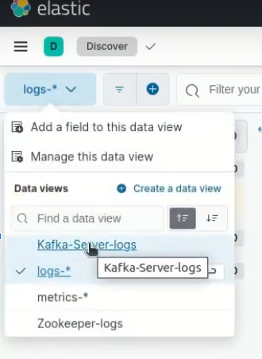
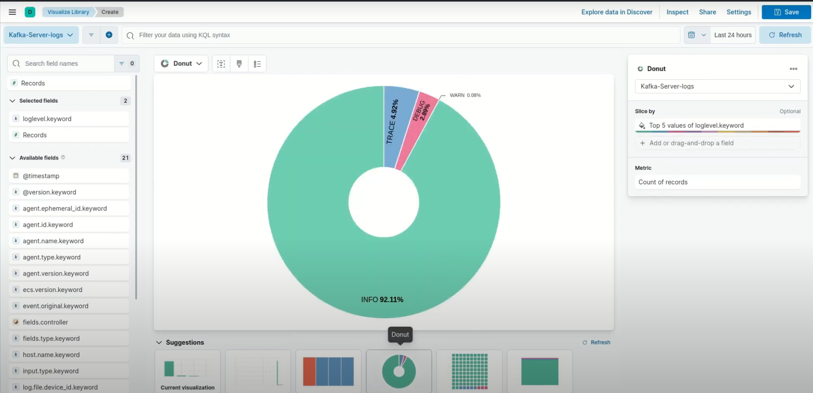
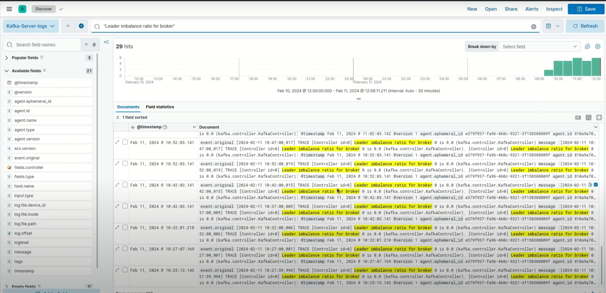
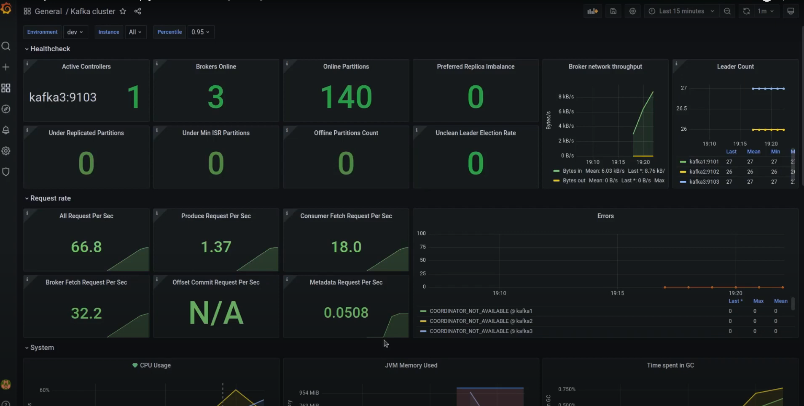

## **Introduction**

In today’s digital economy, data is the lifeblood of business operations. Companies rely on real-time data processing to make informed decisions, optimize operations, and enhance customer experiences. Apache Kafka has emerged as a critical component for enabling the efficient handling of vast amounts of data. However, running Kafka at scale for mission-critical businesses presents unique challenges and opportunities.

After choosing Kafka to streamline data connectivity, the next major task is efficient operation. This article delves into the potential challenges, strategies for mitigating them, and tools that can streamline the operational management of Kafka clusters at scale, ensuring reliability and performance.

## **Understanding the Scale of Kafka Deployment in Mission Critical Environments**

Before deploying Apache Kafka at scale, especially for mission critical applications, understanding and managing various environments like Development (Dev), Pre-Production (Pre-Prod), Disaster Recovery (DR) and Production Environments is essential before deploying Apache Kafka at scale. Each environment serves a unique purpose, and balancing their needs can help ensure that Kafka deployments are reliable, resilient, and efficient.

Here, we delve into the roles of Dev, Pre-Prod, DR and Production Environments which is commonly seen architecture in critical deployments. This architecture is commonly seen in critical deployments, although it may vary based on specific organizational requirements.

### **Dev Environment**

The Dev environment is where developers experiment with new ideas, write code, and test features in isolation. It provides a sandbox for innovation without affecting production or PreProd environments.

**CI/CD Pipeline Integration:** Any changes, such as version upgrades or new configurations, should first be applied in the Dev environment. Here, they undergo initial testing and validation to ensure they don’t introduce any issues. This process should be managed through an automated CI/CD pipeline that ensures consistency and speed.

### **PreProd Environment**

The PreProd environment is a staging ground for testing new features, configurations, and updates before they go live in production. It mimics the production environment to identify potential issues and ensure changes don't negatively impact live operations.

**CI/CD Pipeline Integration**: After successful testing in the Dev environment, the changes should automatically be promoted to the PreProd environment via the CI/CD pipeline. Here, the changes are subjected to further testing, including performance and integration testing, to validate their readiness for production.

### **Disaster Recovery Environment**:

The DR environment is a backup setup designed to mirror the production environment. It serves as a failover solution to maintain business continuity in the event of outage in the production environment.

The DR environment utilizes Kafka's MirrorMaker2/Cluster linking or other replication tools to synchronize data between the production and DR clusters. It is designed to quickly assume production workloads with minimal downtime, ensuring that business processes remain uninterrupted.

**CI/CD Pipeline Integration**: Once the changes have been thoroughly tested in the PreProd environment, the CI/CD pipeline automatically deploys them to the DR environment. This ensures that the DR setup is always in sync with production and ready to take over if needed.

### **Production Environment**

The production environment is the live setting where Kafka processes real-time data for business operations. It must handle high throughput, low latency, and provide seamless data streaming capabilities to support mission-critical applications.

While environments provide the framework for Kafka deployments, it is important to recognize potential pitfalls within a Kafka cluster that can impact its performance and reliability.

**CI/CD Pipeline Integration**: After passing all previous stages, the changes are finally deployed to the Production environment through the CI/CD pipeline. This controlled, step-by-step deployment process minimizes risks and ensures that the production environment remains stable and reliable.

## **Operational Challenges**

Establishing the appropriate Kafka infrastructure is one thing, but ensuring its smooth operation is an entirely different challenge. Below are some common issues that may arise during its operation.

### **Network**

Network issues can significantly impact the performance and stability of a Kafka cluster. Here are some specific network related problems that might arise:

1. **Increased Latency**: Network issues can cause delays in data transmission between producers, brokers, and consumers, slowing down message delivery and retrieval, which affects the overall performance of the Kafka system.
Key node metrics like _transmit_queue_length_, _receive_queue_length_, _receive_drop_total_, and _transmit_drop_total_ are useful for detecting and analyzing such issues.

2. **Packet Loss**: Loss of network packets may lead to incomplete or missing messages, resulting in data loss or corruption.
Key node metrics like _receive_errs_total_, _transmit_errs_total_ can be used to detect such issues.

3. **Broker Connectivity Problems**: Brokers may have difficulty communicating with each other or with producers and consumers due to network problems. This can lead to failed replication, partition reassignments, or difficulties in maintaining cluster health. Persistent network issues can contribute to broker failures.
Monitoring kafka metrics such as _kafka_server_KafkaRequestHandlerPool_RequestHandlerAvgIdlePercent_, _kafka_network_SocketServer_NetworkProcessorAvgIdlePercent_ can help in diagnosing and measuring these issues.

4. **Network Partitioning**: Network partitioning, where different parts of the Kafka cluster become isolated from each other, can cause inconsistencies and disruptions in data flow. This can lead to unavailability of data or inconsistent states across the cluster.
Kafka metrics like _ActiveControllerCount_ can help in identifying this issue.  

5. **DNS Resolution Issues**: Problems with DNS resolution can prevent clients from locating Kafka brokers, leading to connection failures and interruptions in service.
By monitoring node metrics like _dns_resolver_failures_total_ we can identify these issues.

6. **Network Configuration Errors**: Incorrect network configurations, such as misconfigured IP addresses, firewalls or security groups can lead to connectivity issues or network conflicts.
Node metrics like _network_iface_up_ can help identify this issue.

7. **Jitter**: Variability in network delay (jitter) can affect the timing of message delivery and processing, impacting the consistency of data flow.
We can rely on node metrics like _network_receive_multicast_total_ and _network_transmit_multicast_total_ to identify this issue.

### **Input/Output**

Issues related to I/O (Input/Output) on a server running Kafka can significantly impact performance and stability. Here are some specific I/O-related problems that might arise:

1. **High I/O Latency**: Increased latency in I/O operations can slow down read and write processes, leading to delays in message production and consumption.
Node metrics like _disk_io_time_seconds_total_ can help identify this issue. 

2. **I/O Bottlenecks**: Overloaded or slow disk subsystems can create bottlenecks, limiting the overall throughput and affecting Kafka's ability to handle high data volumes efficiently.
Monitoring node metrics such as _disk_io_time_weighted_seconds_total_, _disk_io_now_ can help identify this issue.

3. **I/O Errors**: Errors in I/O operations, such as read/write failures, can cause data corruption, incomplete writes, or read errors, affecting data integrity.
Key node metrics like _disk_errors_total_ can be used to detect this issue.

4. **I/O Saturation**: Saturation of I/O resources, where the disk subsystem reaches its maximum capacity, can lead to delays and failures in processing Kafka messages.
We can rely on node metrics like _disk_saturation_ to identify this issue.

5. **High I/O Utilization**: Excessive I/O usage can overwhelm the disk subsystem, leading to degraded performance and potential slowdowns in Kafka operations.
Node metrics like _node_disk_utilization_ can help identify this issue. 

### **Disk Storage**

When dealing with disk issues on a server running a Kafka broker, several specific problems might arise:

1. **Disk Failures**: Physical disk failures or hardware malfunctions can render the disk inaccessible or cause data corruption.
Node Metrics like _disk_failed_ can be used to identify this issue.

2. **Disk Full**: Running out of disk space can prevent Kafka from writing new data or appending to existing logs, potentially causing brokers to stop accepting new messages.
We can set alerts on metrics like _node_filesystem_avail_bytes_ to get notified when the disk space is low.

3. **Disk Corruption**: File system corruption or sector damage can lead to corrupt log files, impacting data integrity and leading to errors during read or write operations.
We can rely on node metrics like _filesystem_readonly_ to identify this issue.

4. **Disk Fragmentation**: Fragmented disks can result in slower read and write operations as the system struggles to access scattered data.
Key node metrics like _filesystem_fragmentation_ can help identify this issue.

### **Memory**

Issues related to Memory can have a significant impact on the performance, reliability, and stability of a Kafka broker. Here are some common problems that can arise due to insufficient or mismanaged RAM in a Kafka setup:

1. **Out of Memory (OOM) Errors**: When Kafka brokers run out of available memory, Java's garbage collector cannot free up enough space to accommodate new objects, leading to _java.lang.OutOfMemoryError_. This can cause sudden shutdowns or crashes of the broker leading to potential data loss and disconnection of producers and consumers from the broker, causing disruptions in data flow.
Node metrics like _memory_OOM_kill_ can help identify this issue.

2. **High Garbage Collection (GC) Activity**: Excessive or prolonged garbage collection cycles, where the JVM spends a significant amount of time in GC, impacting application responsiveness, increased latency, reduced throughput.
We can rely on metrics like _ava_lang_GarbageCollector_G1_Young_Generation_CollectionTime_ to identify this issue.

3. **Insufficient Page Cache**: When Kafka brokers have limited RAM, the operating system's page cache cannot cache log segments effectively, leading to increased disk I/O.
Node metrics like _memory_page_cache_utilization_ can be used to identify this issue.

4. **Swap Usage**: High swap utilization occurs when the operating system moves pages from RAM to disk leading to severe performance degradation as accessing data from swap is much slower than from RAM.
Monitoring node metrics like _memory_SwapUsed_bytes_ can help identify this issue.

5. **Memory Leaks**: Gradual increase in memory usage over time without release, eventually leading to exhaustion of available memory. Brokers may exhibit unpredictable behavior, leading to errors and inconsistencies.
Observation of consistent decrease of node metrics like _memory_MemAvailable_bytes_ can help identify this issue.

### **CPU Usage**

Issues related to CPU usage can significantly affect the performance and stability of a Kafka broker. Here are some specific problems that might arise:

1. **High CPU Utilization**: When CPU is highly taxed by kafka operation i.e often nearing 100% may lead to increased process latency for producer & consumer, reduced throughput and brokers may become unresponsive to requests, leading to timeouts and client disconnections.
Node metrics like _cpu_seconds_total{mode="idle/system/user"}_ can help identify this issue.

2. **CPU Spikes**: Sudden CPU spikes may lead to inconsistent performance like increased temporary latency, broker may temporarily become unresponsive affecting client operations.
We can rely on Node metrics _like cpu_seconds_total_ to identify this issue.

3. **CPU Contention**: Multiple processes on the same server compete for CPU resources, usually caused by Co-location of other resource-intensive applications on the same server as Kafka, leading to contention and performance degradation. This can increase latency and inconsistency.
Monitoring node metrics like _cpu_cores_scheduled_ can help identify issues here.

4. **High Context Switching**: Excessive context switching occurs when the CPU frequently shifts between tasks, leading to overhead and performance loss. This happens when a large number of active threads or processes are competing for CPU time.
Node metrics like _context_switches_total_ can help identify this issue.

### **Client Side**

In a Kafka ecosystem, producers and consumers play crucial roles in sending and receiving data. However, misconfigurations, or poor implementation on the client side can lead to various problems. 

1. **High Latency in Message Production**: Producers experience delays in sending messages, causing a backlog. This can be caused due to inefficient batching due to poor configuration (_‘batch.size',’ ‘linger.ms’_), Misconfigured _max.in.flight.requests.per.connection_ leading to blocked requests etc.
Kafka metrics like _Kafka_producer_producer_metrics_record_send_latency_avg_ can help identify this issue.

2. **Load Imbalance Across Partitions**: Uneven distribution of messages across partitions, leading to hotspots. This can be caused by poor key selection leading to uneven partition distribution.
We can rely on kafka metrics like  _kafka_server_ReplicaFetcherManager_MaxLag_ to identify this issue.

3. **Incorrect Consumer Configuration**: Consumers may fail to connect, consume messages incorrectly, or experience delays. This can be due to Incorrect _bootstrap.servers_ or _group.id_ configuration, misconfigured auto.offset.reset (e.g., earliest vs latest), Poorly configured _session.timeout.ms_ and _heartbeat.interval.ms_ etc.
Monitoring kafka metrics like _Kafka_consumer_consumer_coordinator_metrics_rebalancetime_avg_ can help identify this issue.

4. **Rebalancing Issues**: Frequent consumer group rebalancing, leading to interruptions in message consumption. This can be due to Frequent changes in consumer group membership (e.g., adding/removing consumers), Incorrectly configured _session.timeout.ms_ and _heartbeat.interval.ms_ settings.
Metrics like _Kafka_consumer_consumer_coordinator_metrics_rebalancetime_max_ can help identify this issue.

## **Key Practices for Efficient Kafka Cluster Operations**

### **Implementing CI/CD Architecture for Kafka Cluster Management**

Establishing a CI/CD architecture for Kafka cluster management is crucial for seamless upgrades and rollbacks. Version control is vital for managing Kafka configurations and ensuring consistency across environments. By centralizing essential Kafka files in a repository, you can streamline the upgrade process and reduce the risk of configuration drift.

For instance, if Kafka is installed using Ansible, having the Ansible playbook readily available is critical for understanding the cluster's setup and applying patches or upgrades in the future. A CI/CD pipeline using tools like Jenkins, Ansible can automate the deployment process, making it more efficient and less error-prone. This approach ensures that changes are tested, approved, and applied consistently across environments.

Also when multiple teams collaborate on a Kafka cluster, changes made by one team can inadvertently affect the cluster's stability. For example, if the infrastructure team updates or patches the Java installation on a server, it might impact the Kafka components running on that server.

 Implementing automated scripts as part of CI/CD pipeline to monitor and detect any software changes on the server can help identify potential problems early. These scripts can provide insights into configuration changes, missing dependencies, or unexpected software updates that may not have alerts set up. By ensuring the cluster's health and consistency, you can maintain smooth operations and minimize disruptions.

### **Effective Monitoring of kafka Cluster**

Monitoring Kafka clusters is crucial for maintaining smooth and efficient operations. By closely tracking key metrics, you can detect potential issues early and take corrective actions before they escalate into larger problems. 

To effectively monitor Kafka clusters, it is crucial to implement custom tooling solutions such as Prometheus-Grafana, Datadog, or New Relic. These tools provide comprehensive insights into the cluster's health and performance, enabling proactive management. Configuring alerts for these critical metrics is equally important. Alerts should notify you before potential disasters occur, allowing you to address issues promptly.

Managing alerts is very crucial to reduce Noisy alerts and false alarms. One way to manage alerts effectively is to differentiate between short-term and long-term issues. For instance, an alert for under-replicated partitions might be temporarily triggered if a Kafka broker node is restarted, which is a short-term issue since the partition will catch up once the broker restarts. However, the same alert becomes crucial if a broker goes down due to a more severe problem. Tools like Prometheus Alert Manager can be utilized to group and prioritize alerts, ensuring effective monitoring and rapid response to potential issues.

## **Custom Tooling for Proactive Management**

It is well known that prevention is better than mitigation. Therefore, early detection and resolution of anomalies in a Kafka cluster is crucial. With this in mind, we designed and implemented operational tools for managing, monitoring, and securing Kafka clusters.

### **Kafka-CP-Log-Monitor**

The Kafka-CP-Log-Monitor is a specialized tool designed to efficiently monitor and analyze Kafka component logs from a single, centralized location. By leveraging the ELK stack—Elasticsearch, Logstash, and Kibana—along with Filebeat, this tool provides a robust solution for collecting, parsing, and visualizing Kafka logs across multiple nodes.

This tool addresses several challenges commonly faced when analyzing Kafka component logs. 

#### **Key Features**

* **Centralized Log Collection**: Filebeat is configured on each Kafka component to gather logs, which are then sent to Logstash for processing. This eliminates the need for manual log collection from individual servers.

* **Log Parsing and Visualization**: Logs are parsed using predefined configurations and are made available in the Kibana UI. Users can easily view and analyze these logs, gaining insights into Kafka's performance and identifying potential issues.

#### **Addressing Common Challenges**

The Kafka-CP-Log-Monitor addresses several challenges that users often face when analyzing Kafka component logs:

##### **Access Permissions**

In multi-node Kafka deployments, sufficient permissions were required to SSH into component servers to access logs. The Kafka-CP-Log-Monitor eliminates this need by aggregating logs in a centralized location, streamlining access and improving security.

Below is an image from a 3-node Kafka deployment, showcasing how all the broker and ZooKeeper logs are consolidated and visualized in a centralized place, providing a comprehensive view of the Kafka ecosystem.

##### **Reducing Time Overhead**

Fetching or viewing logs spread across multiple servers can be time-consuming. This tool reduces the overhead by providing a unified interface to access logs from different servers, saving valuable time and effort

##### **Log Searchability**

Searching for errors using grep in large log files is cumbersome and inefficient. With Kafka-CP-Log-Monitor, logs are searchable based on component type, hostname, log level, and more. This significantly speeds up the triage process and enhances the ability to diagnose and resolve issues quickly.

The image below demonstrates how log entries can be filtered, showcasing a specific entry containing the phrase "Leader Imbalance Ratio."

Here is a demo of [Kafka-CP-Log-Monitor](https://www.youtube.com/watch?v=rWhrKLZ8jSg).

### **Kafka-CP-JMX-Monitor**

Kafka-CP-JMX-Monitor is a comprehensive tool designed to capture and visualize Kafka’s JMX metrics, offering deep insights into the health and performance of Kafka clusters.

#### **Key Features**

* **Capture JMX Metrics**: Kafka-CP-JMX-Monitor captures critical JMX metrics exposed by Kafka and presents them as insightful graphs in customizable dashboards, facilitating detailed analysis of cluster operations. 

* **Prometheus and Grafana Integration**: The tool integrates with Prometheus for scraping JMX metrics and uses Grafana to build and visualize dashboards based on the data collected. Grafana also supports configuring alerts based on these metrics.

* **Advanced Alerting**: Kafka-CP-JMX-Monitor provides advanced alerting capabilities, including anomaly detection and rate-of-change monitoring. This helps in proactive issue identification, trend analysis, capacity planning, and potential issue detection.

* **System Metrics Monitoring**: In addition to Kafka JMX metrics, the tool monitors system metrics of Kafka component servers through a node-exporter service, offering a comprehensive view of server performance.

#### **Addressing Common Challenges**

##### **Comprehensive Cluster Visibility**

By capturing and visualizing JMX metrics, Kafka-CP-JMX-Monitor offers a clear view of the cluster’s operational health, enabling us to predict and address potential issues before they become significant problems.

Below is a snapshot of some of the Kafka broker metrics as seen in the Grafana dashboard coming from the Prod environment.

#### **Efficient Capacity Planning**

The tool’s trend analysis and visualization capabilities aid in effective capacity planning and resource allocation, ensuring optimal performance and preventing resource shortages.

#### **Proactive Issue Detection**

Advanced alerting features help in detecting anomalies at both the cluster and individual node levels, drastically reducing the occurrence of major issues and improving overall cluster stability.

Here is a demo of [Kafka-cp-jmx-dashboard](https://www.youtube.com/watch?v=1Mr2iy2RkA8).

### **Kafka-cp-deploy-manager**

“kafka-cp-deploy-manager” automates Kafka cluster lifecycle management, handling version upgrades, configuration changes, and scaling operations seamlessly.

#### **Key Features**

* **State Management**: It maintains the state of the Kafka cluster at any given time, facilitating automated deployments that align with the desired state. 
* **Version Control**: It uses a GitHub-like version control system to manage state files of the Kafka cluster, allowing for easy rollbacks if issues arise.
* **Continuous Deployment with Jenkins**: Jenkins handles continuous deployment based on state changes, simplifying deployment with configurable variables in an interactive UI and abstracting deployment complexity.

#### **Addressing Common Challenges**

##### **Consistent and Reproducible Pipelines**

Kafka-CP-Deploy-Manager ensures uniformity in deployment processes, leading to consistent and reproducible pipelines.

##### **Error Mitigation**

The tool reduces human errors during deployment by automating and streamlining the process.

##### **Smooth Upgrades and Rollbacks**

Versioned state files facilitate smooth upgrades and rollbacks, maintaining stability throughout the deployment process.

##### **Privilege Isolation**

The tool segregates write and execute privileges, allowing administrators to manage state files while developers handle deployments.

Here is a demo of [Kafka-cp-deploy-manager](https://www.youtube.com/watch?v=oRAipiWWIDg).

## **Conclusion**

Running Kafka at scale for mission-critical customers is both complex and rewarding. By mastering the Kafka ecosystem and adhering to best practices in sizing, tooling, deployment, and performance optimization, organizations can fully leverage Kafka’s potential. These tools have significantly enhanced our monitoring and management capabilities, contributing to a more efficient and reliable data streaming infrastructure
