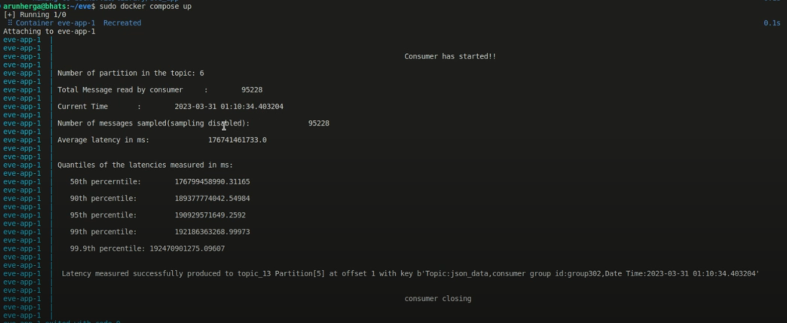
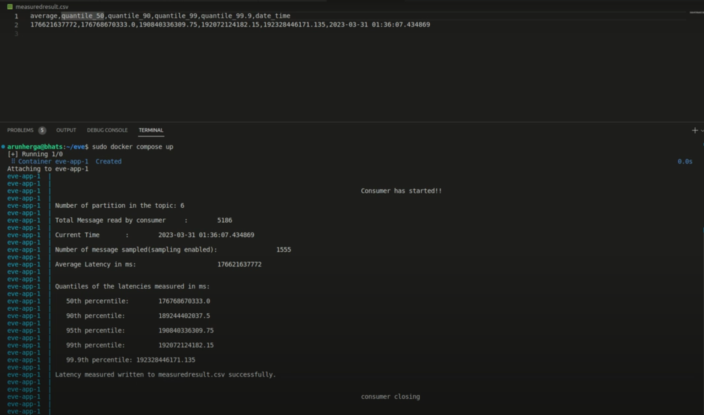

#### **Introduction: What is Latency?**

Latency, in the context of data systems, refers to the delay between the time a message is sent and when it is received or processed. In Apache Kafka, a distributed streaming platform, latency is the time taken for data to travel from producers to consumers through the Kafka brokers. This includes the time spent in network communication, data serialization and deserialization, and processing within Kafka itself. Low latency is crucial for real-time applications where timely data processing is essential, such as fraud detection systems, real-time analytics, monitoring systems etc.


#### **The Impact of Latency in Real-Time Data Pipelines**

Latency can have significant consequences in real-time data pipelines. When latency is high, the freshness of the data deteriorates, which can lead to delayed decision-making. In critical applications like fraud detection, monitoring, or real-time analytics, this delay can result in missed opportunities, financial loss, or even security vulnerabilities. For instance, a high-latency pipeline might not alert a system to an anomaly quickly enough, rendering the entire monitoring process ineffective.

Moreover, prolonged latency can cause a ripple effect across dependent systems, amplifying delays as data moves through each stage of the pipeline. This can degrade the overall user experience, especially in applications where users expect near-instantaneous feedback.


#### **What Causes Latency in Kafka?**

Several factors can contribute to latency in Kafka:


1. **Network Latency**: This occurs due to the time taken for data to travel between producers, brokers, and consumers across a network. High network latency can be caused by physical distance, network congestion, or suboptimal network configurations.
2. **Broker Performance**: Kafka brokers manage the storage and retrieval of messages. If brokers are overwhelmed with excessive data or are not properly tuned, they can become bottlenecks, leading to increased latency
3. **Producer and Consumer Configuration**: The configurations of producers and consumers, such as batch size, linger time, and buffer memory, can significantly influence latency. Smaller batch sizes and lower linger times may reduce latency but at the cost of increased network overhead.
4. **Disk I/O**: Kafka writes data to disk for durability. If the disk is slow or the disk I/O is high, it can delay the time it takes to store and retrieve messages, thus increasing latency.
5. **Garbage Collection**: Kafka runs on the JVM, and improper garbage collection tuning can lead to pauses that contribute to latency.
6. **Replication Factor**: Kafka's replication ensures data durability, but higher replication factors can introduce additional overhead, as data needs to be copied to multiple brokers, increasing the time it takes to fully process a message.


#### **Measuring Latency in Kafka**

Understanding and measuring latency is key to optimizing Kafka's performance. Here are some methods to measure and monitor latency:


1. **End-to-End Latency Measurement**: This involves measuring the total time from when a message is produced to when it is consumed. This can be done by attaching timestamps at the producer level and comparing them with timestamps at the consumer end.
2. **Producer Acknowledgement Latency**: Kafka producers can be configured to wait for acknowledgments from brokers before considering a message successfully sent. Measuring the time taken to receive these acknowledgments gives insight into how quickly brokers are processing messages.
3. **Broker Metrics**: Kafka provides a wealth of metrics through JMX, which can be monitored using tools like Prometheus and Grafana. Key metrics include RequestTimeMs, ReplicationLatency, FlushTime etc which help identify bottlenecks within brokers.
4. **Consumer Lag**: Consumer lag is the difference between the last produced offset and the last consumed offset. Monitoring lag can provide insights into how far behind consumers are in processing messages, which indirectly indicates latency.
5. **Network Monitoring Tools**: Tools like Wireshark can be used to analyze network packets and measure network latency between Kafka components.


#### **Introducing Kafka Latency Profiler:**

The Kafka Latency Profiler is a Dockerized application built to monitor and analyze the time it takes for messages to move through a Kafka topic. By capturing and calculating detailed latency metrics, it provides valuable insights into the performance and efficiency of message processing, helping to identify potential bottlenecks and optimize system performance.

You can find the GitHub repository for the Kafka Latency Profiler[ here](https://github.com/Platformatory/Kafka-latency-profiler).


##### **Steps to configure and run this profiler:**

**Configure the arguments.env File**: Before diving into the Dockerized magic, set up the arguments.env file with essential configuration settings:


    #It has the following variables to be defined. 


    _CONSUMER_CONFIG_FILE_: The path to the configuration file for the Kafka consumer. This file contains properties required to connect to Kafka, such as broker URLs, security settings, etc.


    _INPUT_TOPIC_: The name of the Kafka topic from which the consumer will be consuming messages.


    _GROUP_ID_: The consumer group ID to which the consumer belongs.


    _VALUE_DESERIALIZER_: The deserializer to be used for deserializing the message values. Options are AvroDeserializer, JSONDeserializer, StringDeserializer, or JSONSchemaDeserializer.


    _KEY_DESERIALIZER_: The deserializer to be used for deserializing the message keys.  Options are AvroDeserializer, JSONDeserializer, StringDeserializer, or JSONSchemaDeserializer.


    _RUN_INTERVAL_: The time interval (in seconds) for which the consumer will run and collect latency statistics. Default value is 120 seconds.


    _T1_: It is one of the time parameters(used to measure latency->t2-t1). value.column name - this is a pointer to message value timestamp i.e any column/object in value that points to event time. key.column name - this is a pointer to message key timestamp i.e any column/object in key that points to event time. IngestionTime implies the time when a message is recorded in kafka topic. Set to IngestionTime by default.


    _DATE_TIME_FORMAT_: The format of the datetime strings found in the messages, used when parsing timestamps. Default value is "epoch."


    _T2_:It is one of the time parameters (used to measure latency->t2-t1). ConsumerWallClockTime -this is a pointer to the current time, as seen in the consumer. IngestionTime implies the time when a message is recorded in kafka topic. Choices include - 'consumerWallClockTime' , 'IngestionTime'.


    _CONSUMER_OUTPUT_: The type of output for the consumer's latency statistics. Options include 'console' ( for printing statistics in console (by default) ), "dumpToTopic" (for producing statistics to an output topic), "localFileDump" (for writing statistics to a local CSV file).


    _OUTPUT_TOPIC_: The name of the Kafka topic where the latency statistics should be produced if the output type is "dumpToTopic."


    _RESULT_DUMP_LOCAL_FILEPATH_: The local file path for writing the latency statistics if the output type is "localFileDump."


    _PRODUCER_CONFIG_FILE_: The path to the configuration file for the Kafka producer, required if producing statistics to an output topic.


    _ENABLE_SAMPLING_: A flag indicating whether sampling should be enabled. Options are "True" or "False.".Default is “False”

**Build and Run:**

Execute the following commands in the directory containing the Docker Compose file:


```
  docker compose build

  docker compose up 
```


The Kafka Latency Profiler script calculates various statistics based on collected latency values. It computes average latency, quantiles, and conducts sampling if enabled, providing valuable insights into your Kafka-based data streaming applications.

**Sample outputs:**

Sample 1: 

Here more than 95k messages were read and sampled as sampling was disabled, and the different latency measured were saved in a kafka topic. 




Sample 2:

Here 5k messages were read and 1.5k messages were sampled as sampling was enabled and different latency measured were saved in a CSV file. 




#### **Conclusion**

Latency in Kafka is a critical factor that can significantly impact the performance and reliability of real-time data pipelines. Understanding the causes of latency and effectively measuring it are essential steps in optimizing Kafka for low-latency operation. By monitoring key metrics and tuning Kafka’s configuration, it is possible to minimize latency and ensure that your real-time applications remain responsive and efficient.

Whether you're running a small Kafka cluster or managing a large-scale deployment, being proactive about latency will help you maintain a robust and high-performance streaming platform.
