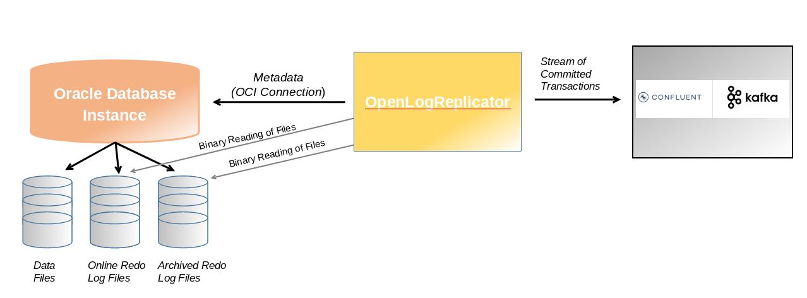

# Introduction

  In the evolving landscape of real-time data processing, Change Data Capture (CDC) is essential for keeping data systems synchronized. Debezium, combined with the Confluent Platform, provides a robust solution for streaming database changes directly into Apache Kafka. When integrating with Oracle Database, Debezium can be configured to OpenLogReplicator which uses binary reading of redo logs and publish database transactions efficiently.



> Source - [OpenLogReplicator]
  
  In this blog, we'll walk you through configuring Debezium’s Oracle connector within the Confluent Platform. You'll learn how to set up OpenLogrReplicator, configure Debezium, and stream changes into your Kafka topics seamlessly. This guide covers:
  
    - Preparing your Oracle Database for CDC with OpenLogReplicator.
    - Configuring the Debezium connector on Confluent Platform.
    - Validating and monitoring the data flow.
  
  By the end, you'll have a powerful CDC pipeline ready to capture and stream changes from Oracle to Kafka, enabling real-time data integration and analytics. Let's dive in!


# Confluent Platform Overview

  Confluent Platform is a streaming platform that enables user to store, and manage data as real-time streams. It enabled transformations through stream processing, simplifies enterprise operations at scale. Confluent Platform can be downloaded and managed by user. This is a specialized distribution system of Kafka with many commercial features built into Kafka brokers that function as Confluent Server. Confluent facilitates the development of a whole new class of contemporary, event-driven applications, provides a universal data pipeline, and opens up potent new use cases with complete performance, scalability, and dependability.


# OpenLogReplicator Overview

  OpenLogReplicator is an open-source project created by Adam Leszczyński. OpenLogReplicator does not depend on any specific configuration of the source database. With no impact on the source system and not utilizing Oracle LogMiner, OpenLogReplicator primarly targets Kafka systems capturing change component.


# Pre-requisite

  - Internet Connection
  - OS supporting Confluent Platform
  - Docker Engine 1.11 or higher installed


# Setting up Debezium Container Image

  1. Clone the github OpenLogReplicator repository 
  ```
    $> git clone https://github.com/bersler/OpenLogReplicator-tutorials.git
  ```

  2. Navigate to folder OpenLogReplicator-tutorials → images and execute script bersler_openlogreplicator_tutorial.sh to build OpenLogReplicator container image.
  
  ```
  $> ./bersler_openlogreplicator_tutorial.sh
  ```

# Setting up Confluent Platform

  1. Download Oracle JDBC Driver from Oracle JDBC Driver page. You need to download zipped JDBC driver for Oracle DB 21c. Extract the zip file.
  2. Download the Confluent Platform KRaft all-in-one Docker Compose file using below command. The docker compose file is a configuration file used to quickly set up a local Confluent Platform environment with all the essential components like Kafka, Schema Registry, and Connect, specifically utilizing the "KRaft" mode for managing Kafka cluster metadata allowing user to easily run a full Confluent Platform instance in a single Docker command using the "cp-all-in-one" image with KRaft enabled.

  ```
  $> wget https://raw.githubusercontent.com/confluentinc/cp-all-in-one/7.8.0-post/cp-all-in-one-kraft/docker-compose.yml
  ```

3. Update docker-compose.yaml file with below changes:
  
  ```
  kafka-connect:
    image: debezium/connect:2.7.3.Final
    hostname: kafka-connect
    container_name: kafka-connect
    depends_on:
      - broker
      - schema-registry
    ports:
      - "8083:8083"
    environment:
      BOOTSTRAP_SERVERS: 'broker:29092'
      GROUP_ID: 1 
      CONFIG_STORAGE_TOPIC: "my_connect_configs"
      OFFSET_STORAGE_TOPIC: "my_connect_offset"
      STATUS_STORAGE_TOPIC: "my_connect_status"
      #KAFKA_CLASSPATH: /opt/oracle/ojdbc8.jar
      LD_LIBRARY_PATH: /kafka/instantclient_21_16
    volumes:
        - ./basic/instantclient_21_16:/kafka/instantclient_21_16

  oracle:
    image: heartu41/oracle19c
    container_name: oracle
    ports:
      - "1521:1521"
    environment:
      ORACLE_PWD: "Oracle123"
      ORACLE_SID: "ORCLCDB"
      ENABLE_ARCHIVELOG: true
      ENABLE_FORCE_LOGGING: true

    volumes:
       - ./fra:/opt/oracle/fra
       - ./oradata:/opt/oracle/oradata
       - ./sql:/opt/sql
       - ./setup:/opt/oracle/scripts/setup

  openlogreplicator:
    image: bersler/openlogreplicator:tutorial
    container_name: openlogreplicator
    ports:
      - "8080:8080"
    depends_on:
      - oracle
    volumes:
      - ./checkpoint:/opt/OpenLogReplicator/checkpoint
      - ./fra:/opt/fra
      - ./log:/opt/OpenLogReplicator/log
      - ./oradata:/opt/oradata
      - ./output:/opt/output
      - ./scripts:/opt/OpenLogReplicator/scripts
    restart: "no"

  ```

4. Create below listed directories and respective ownership requried for setting up OpenLogReplicator connector:

  ```
    mkdir oradata
    chmod 755 oradata
    sudo chown 54321:54321 oradata
    
    mkdir fra
    chmod 755 fra
    sudo chown 54321:54321 fra
    
    chmod a+x+r+w sql
    chmod a+r sql/*.sql
    
    mkdir checkpoint
    chmod 777 checkpoint
    
    mkdir log
    chmod 777 log
    
    mkdir output
    chmod 777 output
    
    chmod 777 scripts
    chmod 644 scripts/OpenLogReplicator.json
  ```

5. Create file OpenLogReplicator.json under scripts folder with content:

  ```
  {
    "version": "1.7.0",
    "log-level": 3,
    "source": [
      {
        "alias": "S1",
        "name": "ORA1",
        "reader": {
          "type": "online",
          "path-mapping": ["/opt/oracle/oradata", "/opt/oradata", "/opt/oracle/fra", "/opt/fra"],
          "user": "c##dbzuser",
          "password": "dbz",
          "server": "//oracle:1521/ORCLPDB1"
        },
        "format": {
          "type": "json"
        },
        "filter": {
          "table": [
            {"owner": "c##dbzuser", "table": "customers"}
          ]
        }
      }
    ],
    "target": [
      {
        "alias": "T1",
        "source": "S1",
        "writer": {
          "type": "file",
          "output": "/opt/output/results.txt"
        }
      }
    ]
  }
```

6. Start Confluent Platform stack in detach mode:

  ```
  $> docker compose up -d
  ```

  Each component of Confluent Platform starts in separate container.
  
  ```
  Creating broker   ... done
  Creating schema-registry  ... done
  Creating rest-proxy       ... done
  Creating connect          ... done
  Creating ksqldb-server    ... done
  Creating control-center   ... done
  Creating ksql-datagen     ... done
  Creating ksqldb-cli       ... done
  Creating oracle  ... done
  ```

  You can verify if all services are up and running using command “docker compose ps -a”

# Configuring Oracle Database

  When Oracle DB container starts for the first time, there are no initial configuration and database exists. Hence database will be installed and configuration will be started. This process may take 10-20 mins (approx). You can verify readiness of Oracle DB from container logs (docker compose logs oracle) and should see message:

  ```
  #############################
  DATABASE IS READY TO USE!
  #############################
  ```
  
  In order to incorporate changes from an Oracle database, a number of database configurations are required:

# _Enable Archive Logs_

  The Oracle container registry image used in the Install Oracle section may not have archive logging enabled. If you use another image or a pre-existing environment, you should check whether archive logging is enabled.

  ```
  $> docker compose exec oracle bash
  $> sqlplus ‘/ as sysdba’
  
  SQL> SELECT LOG_MODE FROM V$DATABASE
  ```

  If the column contains ARCHIVELOG, then archive logging is enabled. If the column contains the value NOARCHIVELOG, archive logging isn’t enabled, and further configuration is necessary.
  
  Execute the following SQL commands inside the SQL*Plus terminal window:
  
  ```
  ALTER SYSTEM SET db_recovery_file_dest_size = 10G;
  ALTER SYSTEM SET db_recovery_file_dest = '/opt/oracle/oradata/ORCLCDB' scope=spfile;
  SHUTDOWN IMMEDIATE
  STARTUP MOUNT
  ALTER DATABASE ARCHIVELOG;
  ALTER DATABASE OPEN;
  ARCHIVE LOG LIST;
  ```

  Output of last executed SQL command should show Archive mode for Database log mode.
  
  ```
  Database log mode                  Archive Mode
  Automatic archival                 Enabled
  Archive destination                USE_DB_RECOVERY_FILE_DEST
  Oldest online log sequence         1
  Next log sequence to archive       3
  Current log sequence               3
  ```

# _Configure Redo Logs_

  Oracle Redo logs are the transactional logs. Using the same terminal window, execute below listed SQL command to determine filenames, location of redo logs and recreate log group with size of 400 MB using same log file.

  ```
  SQL> SELECT GROUP#, MEMBER FROM V$LOGFILE ORDER BY 1, 2;

  GROUP# MEMBER
  ---------- ---------------------------------------------------
    1 /opt/oracle/oradata/ORCLCDB/redo01.log
    2 /opt/oracle/oradata/ORCLCDB/redo02.log
    3 /opt/oracle/oradata/ORCLCDB/redo03.log
  
  
  ALTER DATABASE CLEAR LOGFILE GROUP 1; 
  ALTER DATABASE DROP LOGFILE GROUP 1; 
  ALTER DATABASE ADD LOGFILE GROUP 1 ('/opt/oracle/oradata/ORCLCDB/redo01.log') size 400M REUSE;
  ALTER SYSTEM SWITCH LOGFILE;
  ```

# _Configure Supplemental Logging_

  Database supplementary logging needs to be enabled at the very least for Debezium to communicate with LogMiner, handle chained rows, and work with different storage configurations.

  ```
  SQL> ALTER DATABASE ADD SUPPLEMENTAL LOG DATA
  ```

# _Configuring Users in Oracle DB_

  
  To capture change events, the Debezium connector needs to establish a JDBC connection to the Oracle database and interact with LogMiner APIs. This requires a dedicated database user account with specific permissions to access LogMiner and read data from the target tables.

  In the same SQLplus terminal window, create table spaces:

  ```
  CONNECT sys/oraclepw@ORCLCDB as sysdba; 
  CREATE TABLESPACE logminer_tbs DATAFILE '/opt/oracle/oradata/ORCLCDB/logminer_tbs.dbf' SIZE 25M REUSE AUTOEXTEND ON MAXSIZE UNLIMITED; 

  CONNECT sys/oraclepw@ORCLPDB1 as sysdba; 
  CREATE TABLESPACE logminer_tbs DATAFILE '/opt/oracle/oradata/ORCLCDB/ORCLPDB1/logminer_tbs.dbf' SIZE 25M REUSE  AUTOEXTEND ON MAXSIZE UNLIMITED;
  ```

  > NOTE – Replace oraclepw with the password set in docker compose file.

  ```
  CONNECT sys/oraclepw@ORCLCDB as sysdba; 
  CREATE USER c##dbzuser IDENTIFIED BY dbz DEFAULT TABLESPACE LOGMINER_TBS  QUOTA UNLIMITED ON LOGMINER_TBS CONTAINER=ALL;

  GRANT CREATE SESSION TO c##dbzuser CONTAINER=ALL;
  GRANT SET CONTAINER TO c##dbzuser CONTAINER=ALL;
  GRANT SELECT ON V_$DATABASE TO c##dbzuser CONTAINER=ALL;
  GRANT FLASHBACK ANY TABLE TO c##dbzuser CONTAINER=ALL;
  GRANT SELECT ANY TABLE TO c##dbzuser CONTAINER=ALL;
  GRANT SELECT_CATALOG_ROLE TO c##dbzuser CONTAINER=ALL;
  GRANT EXECUTE_CATALOG_ROLE TO c##dbzuser CONTAINER=ALL;
  GRANT SELECT ANY TRANSACTION TO c##dbzuser CONTAINER=ALL;
  GRANT SELECT ANY DICTIONARY TO c##dbzuser CONTAINER=ALL;
  GRANT LOGMINING TO c##dbzuser CONTAINER=ALL;
  
  GRANT CREATE TABLE TO c##dbzuser CONTAINER=ALL;
  GRANT LOCK ANY TABLE TO c##dbzuser CONTAINER=ALL;
  GRANT CREATE SEQUENCE TO c##dbzuser CONTAINER=ALL;
  
  GRANT EXECUTE ON DBMS_LOGMNR TO c##dbzuser CONTAINER=ALL;
  GRANT EXECUTE ON DBMS_LOGMNR_D TO c##dbzuser CONTAINER=ALL;
  
  GRANT SELECT ON V_$LOG TO c##dbzuser CONTAINER=ALL;
  GRANT SELECT ON V_$LOG_HISTORY TO c##dbzuser CONTAINER=ALL;
  GRANT SELECT ON V_$LOGMNR_LOGS TO c##dbzuser CONTAINER=ALL;
  GRANT SELECT ON V_$LOGMNR_CONTENTS TO c##dbzuser CONTAINER=ALL;
  GRANT SELECT ON V_$LOGMNR_PARAMETERS TO c##dbzuser CONTAINER=ALL;
  GRANT SELECT ON V_$LOGFILE TO c##dbzuser CONTAINER=ALL;
  GRANT SELECT ON V_$ARCHIVED_LOG TO c##dbzuser CONTAINER=ALL;
  GRANT SELECT ON V_$ARCHIVE_DEST_STATUS TO c##dbzuser CONTAINER=ALL;
  GRANT SELECT ON V_$TRANSACTION TO c##dbzuser CONTAINER=ALL;
  
  EXIT;

  ```

# _Create Initial Test Data_

  Connect to Oracle DB using command:

  ```
  $> sqlplus ‘/ as sysdba’
  SQL> connect c##dbzuser/dbz
  SQL> alter session set container=ORCLPDB1;
  ```

  After connecting to ORCLPDB1, create table and some initial data.

  ```
  CREATE TABLE customers (id number(9,0) primary key, name varchar2(50)); INSERT INTO customers VALUES (1001, 'Jane Doe'); 
  INSERT INTO customers VALUES (1002, 'Bob Willy'); 
  INSERT INTO customers VALUES (1003, 'Eddie Murphy'); 
  INSERT INTO customers VALUES (1004, 'Anne Mary'); 
  COMMIT;
  ```

  Set the table’s supplemental log level:

  ```
  ALTER TABLE customers ADD SUPPLEMENTAL LOG DATA (ALL) COLUMNS;
  ```

# Deploy Debezium Oracle Connector

  Create a source connector file “source_Debezium_OpenLogReplicator.json” with configuration:

  ```
  {
    "name": "openlogreplicator",
    "config": {
      "connector.class": "io.debezium.connector.oracle.OracleConnector",
      "tasks.max": "1",
      "topic.prefix" : "server1",
      "database.hostname": "oracle",
      "database.port": "1521",
      "database.user": "c##dbzuser",
      "database.password": "dbz",
      "database.dbname": "ORCLCDB",
      "database.pdb.name": "ORCLPDB1",
      "database.server.name": "server1",
      "table.include.list": "C##DBZUSER.CUSTOMERS",
      "database.history.kafka.bootstrap.servers": "broker:29092",
      "database.history.kafka.topic": "schema-changes",
      "schema.history.internal.kafka.bootstrap.servers" : "broker:29092",
      "schema.history.internal.kafka.topic": "schema-changes.customers"
    }
  }
  ```

  Save above configuration and deploy the source connector 

  ```
  $> curl -i -X POST -H "Accept:application/json" \ -H "Content-Type:application/json" \ localhost:8083/connectors \ -d @ source_Debezium_OpenLogReplicator.json | jq
  ```

  Once the source connector registration is successful, open Confluent Platform Control Center using http://<host-ip>:9021 in a browser. Navigate to Overview → Topics. You should see a topic “server1.C__DBZUSER.CUSTOMERS’ listed there. Click on the topic and verify the contents of topic.


# Conclusion

  This concludes the deployment of the Oracle Debezium connector with OpenLogReplicator, which captures changes in the CUSTOMERS table. We successfully set up and configured the pipeline to enable real-time change data capture from Oracle to Kafka. This integration ensures efficient and reliable data streaming, allowing downstream systems to consume updates as they happen. With this foundation in place, you can further enhance the pipeline by adding transformations, monitoring, or scaling it for enterprise workloads.


[//]: 

   [OpenLogReplicator]: <https://github.com/bersler/OpenLogReplicator/blob/master/documentation/introduction/introduction.adoc#openlogreplicator>

