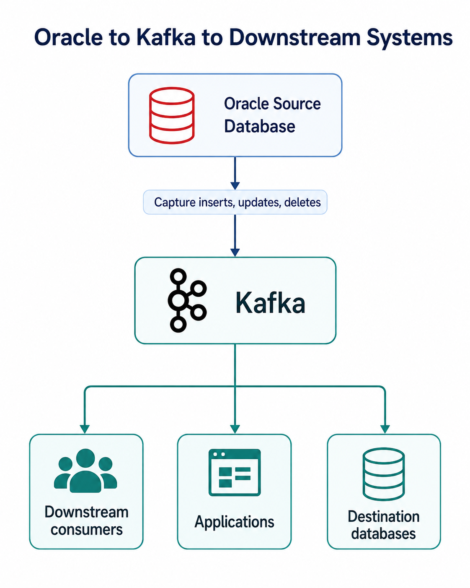
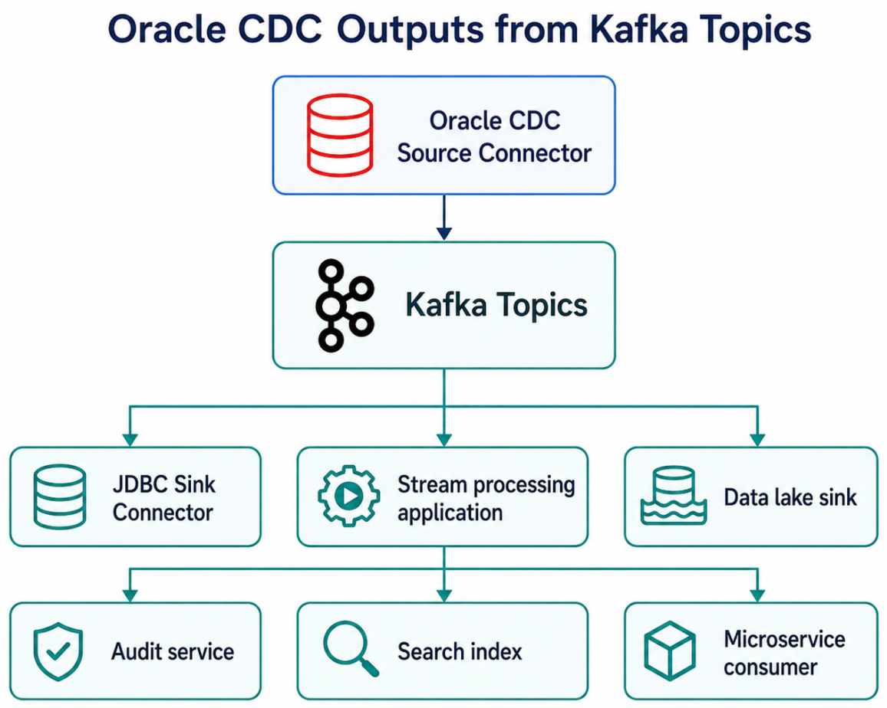
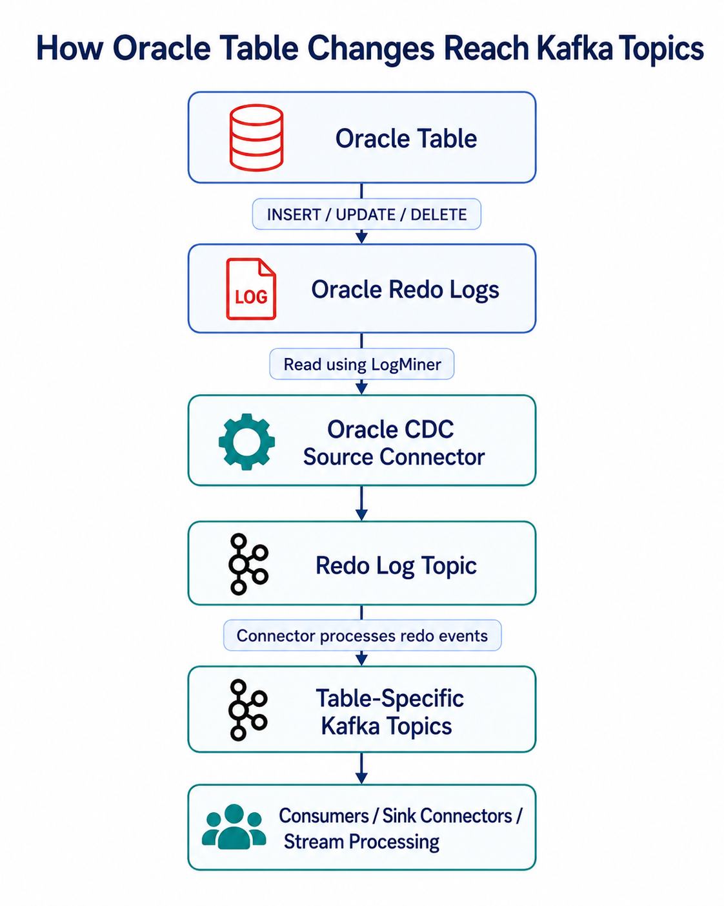
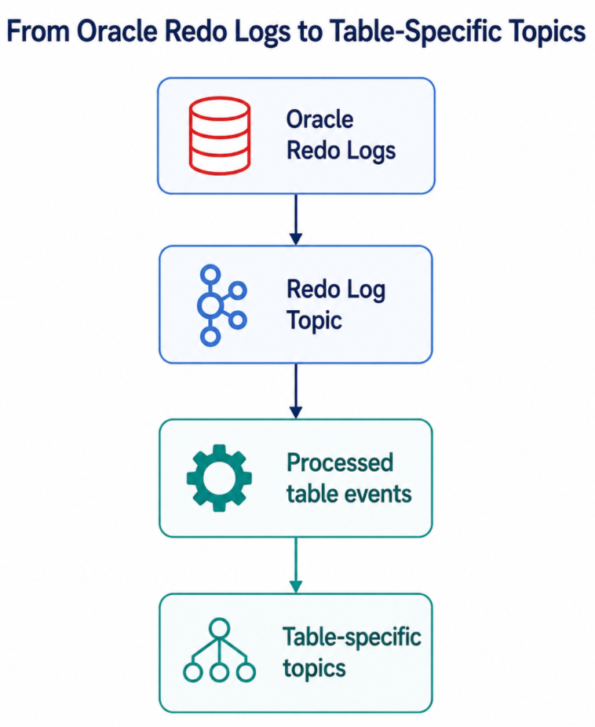
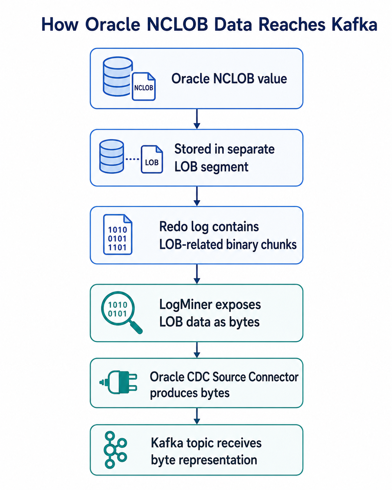
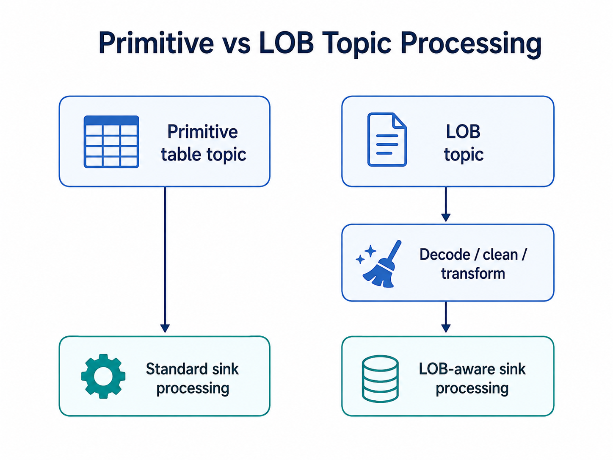
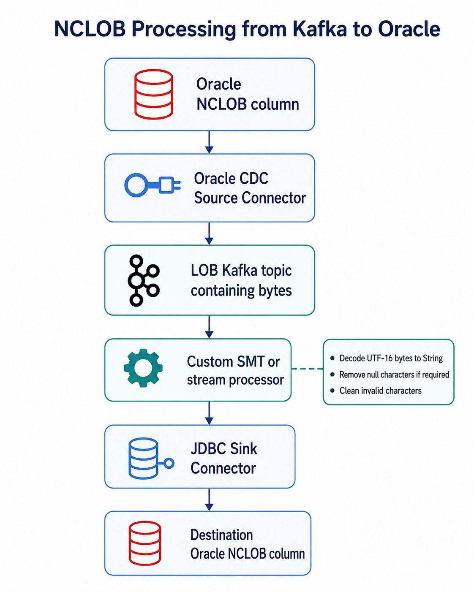
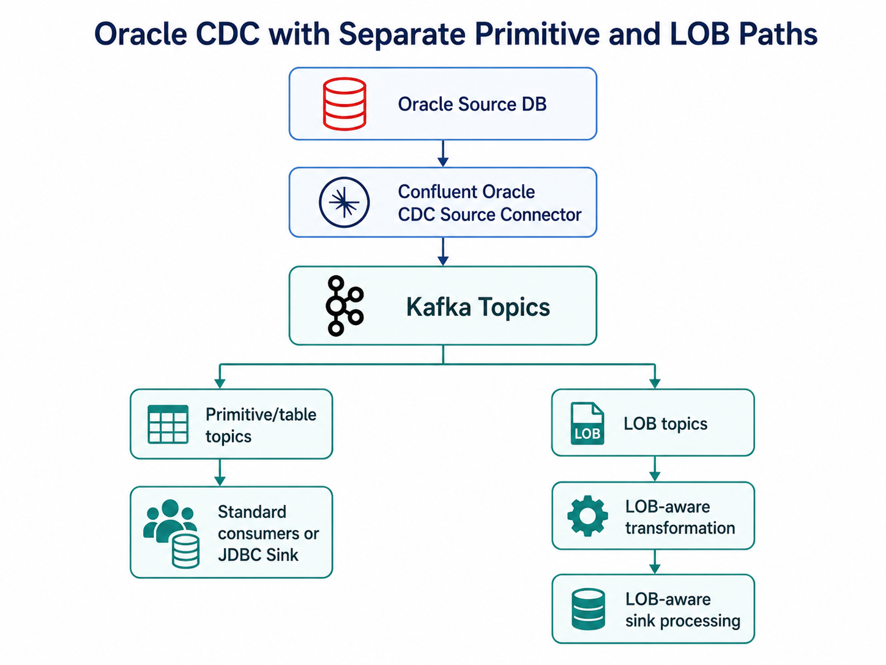

# Demystifying Oracle CDC with Confluent: How Database Changes Flow into Kafka


## Introduction

Modern data platforms increasingly depend on real-time or near-real-time data movement. Traditional batch-based ETL still has its place, but for many use cases such as operational reporting, downstream synchronization, audit pipelines, fraud detection, and event-driven applications, waiting for hourly or daily jobs is no longer sufficient.

This is where **Change Data Capture**, or **CDC**, becomes important.

CDC allows applications and data platforms to capture changes from a database as they happen and publish those changes to downstream systems. In the Oracle ecosystem, this is commonly done by reading database redo logs and converting committed database changes into events.

In this blog, we will look at how data moves from **Oracle Database to Kafka** using the **Confluent Oracle CDC Source Connector**. We will also discuss what happens internally at a high level, what to check in Oracle table structures before implementing CDC, how different Oracle data types are represented in Kafka Connect, and why LOB columns such as `BLOB`, `CLOB`, and `NCLOB` require special attention.

This article is based on a practical Oracle CDC implementation where Oracle source data, including primitive columns and `NCLOB` data, was streamed through Confluent Platform using Kafka Connect, Kafka topics, Schema Registry, and downstream sink processing.


## What Problem Are We Solving?

The use case is simple to describe:




Instead of writing custom jobs that repeatedly query Oracle tables, CDC captures row-level changes from Oracle and publishes those changes into Kafka topics.

Once the data is in Kafka, multiple consumers can independently process it. One consumer may write the data into another Oracle database. Another may push it to a data lake. Another may enrich it and serve a real-time application.

This is the major benefit of using Kafka for CDC: **Oracle is no longer tightly coupled to every downstream system**.

---

## Why Use Confluent Oracle CDC Source Connector?

There are multiple ways to move Oracle data into Kafka. You could use polling queries, JDBC Source Connector, application-side publishing, Oracle GoldenGate, or custom PL/SQL-based jobs. However, for log-based CDC into Kafka, Confluent Oracle CDC Source Connector provides a purpose-built approach.

The main reasons to choose it are:

### 1. It Captures Changes from Oracle Redo Logs

Oracle records database changes in redo logs. The Confluent Oracle CDC Source Connector uses Oracle LogMiner to interpret those redo logs and identify committed changes.

This avoids repeatedly querying source tables.

With query-based polling, you usually depend on columns such as `LAST_UPDATED_DATE` or incrementing IDs. That approach can miss deletes, can miss certain updates, and usually adds extra read load on source tables.

CDC through redo logs is a better fit when the requirement is to capture actual database changes.


### 2. It Integrates with Kafka Connect

Kafka Connect provides the runtime for running the connector. This gives you a standard framework for:

```text
Connector deployment
Task execution
Offset tracking
Error handling
Converters
Single Message Transforms
Monitoring
Restart and recovery
```

This means you are not building a custom data movement service from scratch. You are deploying a connector into a managed runtime that is already designed for streaming integration workloads.


### 3. It Publishes Database Changes as Kafka Events

Once the connector processes Oracle redo log information, it produces records into Kafka topics.

A common topic pattern is:

```text
<database>.<schema>.<table>
```

For example:

```text
ORCL.ADMIN.USERS
ORCL.ADMIN.ORDERS
ORCL.ADMIN.CUSTOMERS
```

This table-specific topic design makes downstream consumption easier. Consumers can subscribe only to the tables they care about.

---

### 4. It Allows Downstream Decoupling

After Oracle changes are written to Kafka, many downstream systems can consume the same data independently:





This is different from point-to-point database integration. Kafka becomes the central event backbone.

---

### 5. It Supports Schema-Aware Pipelines

When used with Schema Registry and converters such as Avro, JSON Schema, or Protobuf, CDC records can carry structured schemas.

This is important because CDC pipelines are not only moving data values. They are also moving the structure and meaning of the data.

For example:

```text
Oracle NUMBER      -> Kafka Connect Decimal
Oracle VARCHAR2    -> Kafka Connect String
Oracle DATE        -> Kafka Connect Date
Oracle BLOB/CLOB   -> Kafka Connect Bytes
```

Schema awareness helps consumers understand the data format and reduces the risk of silent schema mismatches.

---

## High-Level Internal Working of Oracle CDC Source Connector

At a high level, the data movement from Oracle to Kafka happens in multiple stages.

```text
1. Application changes data in Oracle table
2. Oracle writes change information into redo logs
3. LogMiner reads and interprets redo logs
4. Oracle CDC Source Connector processes LogMiner output
5. Connector writes raw redo log events to a redo log topic
6. Connector converts changes into table-specific Kafka records
7. Records are serialized using configured converter
8. Data lands in Kafka topics
9. Consumers or sink connectors read from Kafka topics
```

A simplified diagram:





In the reference implementation, Oracle DB fed redo logs into the Oracle CDC Source Connector running inside Kafka Connect. The connector used LogMiner, wrote raw redo log events to a redo log topic, and then produced table-specific topics for primitive columns and separate LOB topics for LOB columns.

---

## Understanding the Redo Log Topic

One important internal concept is the **redo log topic**.

The connector does not simply read a table and directly publish rows to Kafka. It works from Oracle redo log information.

A simplified view:





The redo log topic acts as an intermediate Kafka topic containing raw redo log events. The connector processes this information and generates structured change events for the captured tables.

This design helps the connector manage CDC processing, offsets, and table-level event generation.

---

## Table-Specific Topics

For regular table columns, the connector produces data into table-specific topics.

Example:

```text
Oracle Table                 Kafka Topic
------------------------------------------------
ORCL.ADMIN.USERS      --->    ORCL.ADMIN.USERS
ORCL.ADMIN.ORDERS     --->    ORCL.ADMIN.ORDERS
ORCL.ADMIN.CUSTOMERS  --->    ORCL.ADMIN.CUSTOMERS
```

The topic naming can usually be controlled through connector configuration, such as a table topic name template.

Example:

```properties
table.topic.name.template=${fullyQualifiedTableName}
```

This means each Oracle table gets its own Kafka topic based on the fully qualified table name.

This is clean and intuitive for downstream consumers because each table becomes a separate event stream.

---

## What Actually Flows into Kafka?

A CDC event usually represents a database change.

Depending on the connector configuration, converter, and event format, a Kafka record may include:

```text
Primary key
Changed row values
Operation type
Timestamp information
Source metadata
Schema information
Before/after values depending on configuration
```

For example, an insert into an Oracle table:

```sql
INSERT INTO ADMIN.USERS (ID, NAME, STATUS)
VALUES (101, 'Balaji', 'ACTIVE');
```

May become a Kafka event conceptually like:

```json
{
  "ID": 101,
  "NAME": "Balaji",
  "STATUS": "ACTIVE"
}
```

For an update:

```sql
UPDATE ADMIN.USERS
SET STATUS = 'INACTIVE'
WHERE ID = 101;
```

The event may represent the changed state of the row, depending on connector behavior and configuration.

The exact message structure depends on the converter and connector settings, but the core idea is the same: **database row-level changes become Kafka records**.

---

## Why Table Design Matters Before Implementing CDC

Before enabling CDC on Oracle tables, it is important to inspect the table design. Not all tables are equally easy to stream.

At minimum, you should review:

```text
Primary key availability
Column data types
LOB columns
Nullable columns
Timestamp columns
Precision and scale for NUMBER columns
Character set and national character set
Unsupported or complex data types
Expected row size
Expected change volume
Delete behavior
Schema evolution frequency
```

Let us look at the most important checks.

---

## Check 1: Does the Table Have a Primary Key?

For CDC, primary keys are extremely important.

A primary key helps downstream systems identify which row changed.

For example:

```sql
CREATE TABLE CUSTOMER (
    CUSTOMER_ID NUMBER PRIMARY KEY,
    NAME        VARCHAR2(100),
    STATUS      VARCHAR2(20)
);
```

This is CDC-friendly because `CUSTOMER_ID` uniquely identifies the row.

Without a primary key, downstream systems may struggle with updates and deletes. Sink connectors also need a reliable key when using upsert mode.

For example, when writing to a destination Oracle table using JDBC Sink Connector:

```properties
insert.mode=upsert
```

The sink needs to know which column or columns represent the key. Without that, the sink may not be able to update existing rows correctly.

Before implementing CDC, always ask:

```text
Does the table have a primary key?
If not, is there a unique key?
Can a stable business key be used?
How will updates and deletes be handled downstream?
```

---

## Check 2: What Data Types Are Present?

The next important check is column data types.

Simple columns are usually straightforward:

```text
VARCHAR2
NUMBER
DATE
TIMESTAMP
```

Complex or sensitive columns need more attention:

```text
BLOB
CLOB
NCLOB
XMLTYPE
RAW
NUMBER with high precision
TIMESTAMP WITH TIME ZONE
TIMESTAMP WITH LOCAL TIME ZONE
```

Example Oracle-to-Kafka Connect mappings:

```text
Oracle Type                         Kafka Connect Mapping
----------------------------------------------------------
CHAR / VARCHAR / VARCHAR2           String
NCHAR / NVARCHAR2                   String
RAW                                 Bytes
SMALLINT / DECIMAL / NUMBER         Decimal
DOUBLE PRECISION / FLOAT / REAL     Float64
TIMESTAMP WITH TIMEZONE             Timestamp
TIMESTAMP WITH LOCAL TIME ZONE      Timestamp
DATE                                Date
BLOB                                Bytes
CLOB                                Bytes
NCLOB                               Bytes
XMLTYPE                             Bytes
```

This is a critical point.

Many teams assume that `CLOB` and `NCLOB` will appear as normal strings in Kafka. In practice, they may appear as bytes and require additional handling.

---

## Check 3: Are There LOB Columns?

LOB stands for **Large Object**.

Oracle supports different LOB types:

```text
BLOB   -> Binary Large Object
CLOB   -> Character Large Object
NCLOB  -> National Character Large Object / Unicode character large object
```

LOBs are used for large text, documents, XML, JSON, images, PDFs, and other large values.

From a CDC point of view, LOBs are different from primitive columns because they are stored differently inside Oracle.

---

## Primitive Columns vs LOB Columns

Consider this table:

```sql
CREATE TABLE EMPLOYEE (
    ID    NUMBER,
    NAME  VARCHAR2(100),
    NOTES NCLOB
);
```

The primitive columns are:

```text
ID
NAME
```

The LOB column is:

```text
NOTES
```

Primitive columns are stored inline with the row.

Conceptually:

```text
Table Data Block
------------------------------------------------
Row: ID=101, NAME='Balaji', NOTES=[LOB LOCATOR]
------------------------------------------------
```

The row does not store the full `NCLOB` value directly. Instead, the row stores a **LOB locator**.

The actual LOB content is stored separately in a LOB segment.

```text
Separate LOB Segment
------------------------------------------------
LOB Chunk 1: "This is test data for NCLOB..."
LOB Chunk 2: "...continued large text..."
LOB Chunk 3: "...more text..."
------------------------------------------------
```

This difference matters because Oracle redo logs also represent LOB changes differently.

---

## Why LOB Columns Are Challenging in CDC

For primitive columns, LogMiner can provide clean values that the connector can map to Kafka Connect data types.

For example:

```text
NUMBER    -> Decimal
VARCHAR2  -> String
DATE      -> Date
```

For LOB columns, the connector may receive raw byte arrays.

The reason is that LOB content is written into redo logs as binary chunks related to the LOB segment. It is not always represented as a simple readable SQL string.

A simplified flow:





This creates a downstream challenge.

If the target database expects a readable `NCLOB` value, the pipeline may need to decode the byte array into a string before writing it.

---

## LOB Topic Handling

The connector can produce separate LOB topics using a LOB topic name template.

Example:

```properties
lob.topic.name.template=${tableName}-${columnName}-lob
```

Example mappings:

```text
Oracle Table / Column              Kafka LOB Topic
---------------------------------------------------
ORCL.ADMIN.NOTES       --->         ADMIN-NOTES-lob
ORCL.ADMIN.ATTRS       --->         ADMIN-ATTRS-lob
ORCL.ADMIN.REFERENCE   --->         ADMIN-REFERENCE-lob
```

This separation is useful because LOB payloads may be large, encoded differently, and require separate processing logic.

A good design is to treat primitive topics and LOB topics differently.





---

## Character Encoding Matters

LOB handling is not only about large size. It is also about character encoding.

For Oracle LOBs:

```text
BLOB
    Binary data
    No character encoding

CLOB
    Character data
    Uses Oracle database character set

NCLOB
    Unicode character data
    Uses Oracle national character set
```

`NCLOB` is commonly encoded using Oracle national character set `AL16UTF16`, which corresponds to UTF-16 Big Endian.

This means an `NCLOB` value may not be directly readable as a UTF-8 string when emitted as bytes.

For example:

```text
Original NCLOB:
"Customer remarks updated"

CDC output:
byte[] representing UTF-16 encoded content
```

If a sink connector or consumer treats that byte array as a normal UTF-8 string, the result may be corrupted, unreadable, or contain null characters.

---

## Kafka Stores Bytes, But Converters Decide Representation

Kafka brokers are encoding-agnostic. Kafka stores keys and values as bytes.

However, Kafka Connect converters and serializers decide how structured data is represented.

For example:

```text
JSON Converter
    Bytes may be represented as Base64 strings inside JSON

Avro Converter
    Bytes may remain as Avro bytes type

String Converter
    Assumes text representation
```

The key lesson is that Kafka can safely transport the bytes, but your downstream processing must understand what those bytes represent.

---

## Handling NCLOB Data: Example Flow

For an `NCLOB` column, a practical flow may look like this:





Conceptually:

```text
Input from LOB topic:
{
  "ID": "101",
  "NOTES": <byte[]>
}

After custom SMT:
{
  "ID": "101",
  "NOTES": "This is test data for NCLOB..."
}
```

Then the JDBC Sink Connector can write the cleaned string to the destination Oracle table.

---

## What to Check Before Enabling Oracle CDC

Before implementing Oracle CDC with Confluent, I recommend reviewing each source table using a checklist.

### 1. Table Identity

Check:

```text
Schema name
Table name
Primary key
Unique constraints
Expected topic name
Whether table should be included or excluded
```

Why it matters:

The connector needs to know which tables to capture, and downstream systems need a stable way to identify each changed row.

---

### 2. Primary Key and Upsert Behavior

Check:

```text
Does the table have a primary key?
Is the primary key stable?
Can the destination table use the same key?
Will the sink use insert, update, or upsert mode?
```

Why it matters:

Without a proper key, update and delete handling becomes difficult.

---

### 3. Column Data Types

Check all columns and classify them:

```text
Simple types:
VARCHAR2, NUMBER, DATE, TIMESTAMP

Precision-sensitive types:
NUMBER(p,s), DECIMAL, TIMESTAMP WITH TIME ZONE

Binary / complex types:
RAW, BLOB, CLOB, NCLOB, XMLTYPE
```

Why it matters:

Each data type may require different serialization, conversion, or sink-side handling.

---

### 4. LOB Columns

Check:

```text
Does the table have BLOB, CLOB, NCLOB, or XMLTYPE?
How large are these columns?
Are they frequently updated?
Should they be captured?
Should they go to separate LOB topics?
Does the target expect bytes or text?
```

Why it matters:

LOBs are not always plug-and-play in CDC. They may need custom decoding or transformation.

---

### 5. Character Set

Check:

```sql
SELECT parameter, value
FROM nls_database_parameters
WHERE parameter IN (
    'NLS_CHARACTERSET',
    'NLS_NCHAR_CHARACTERSET'
);
```

Why it matters:

`CLOB` and `NCLOB` handling depends on character encoding. For `NCLOB`, you need to know the national character set. If the emitted value is bytes, decoding must use the correct encoding.

---

### 6. Nullable Columns and Default Values

Check:

```text
Which columns are nullable?
Which columns have default values?
How does the sink handle missing or null fields?
Are null LOB values expected?
```

Why it matters:

CDC records may represent nulls, missing fields, or tombstones depending on operation type and configuration.

---

### 7. Deletes and Tombstones

Check:

```text
Should deletes be propagated?
Should the sink delete rows?
Should tombstone messages be generated?
Should downstream consumers ignore or process deletes?
```

Why it matters:

Delete handling must be explicitly designed, especially if Kafka topics are compacted or downstream systems maintain a copy of the source table.

---

### 8. Schema Changes

Check:

```text
How often does the table schema change?
Are new columns expected?
Are column type changes expected?
Who owns schema evolution?
Will consumers tolerate schema changes?
```

Why it matters:

CDC pipelines are sensitive to schema changes. Adding a nullable column may be simple. Changing a column type can break consumers or sink connectors.

---

## Recommended Data Type Review Table

Before implementing CDC, create a table like this for each Oracle table.

```text
Column Name | Oracle Type | Kafka Connect Type | Special Handling Required | Notes
------------|-------------|--------------------|---------------------------|------
ID          | NUMBER      | Decimal            | No                        | Primary key
NAME        | VARCHAR2    | String             | No                        | -
CREATED_AT  | TIMESTAMP   | Timestamp          | Validate precision        | -
NOTES       | NCLOB       | Bytes              | Yes                       | Decode UTF-16
FILE_DATA   | BLOB        | Bytes              | Maybe                     | Keep as binary
XML_PAYLOAD | XMLTYPE     | Bytes              | Yes                       | Decide text vs bytes
```

This exercise is extremely useful because it prevents surprises after connector deployment.

---

## Recommended Architecture Pattern

For a production CDC pipeline, avoid treating all columns and topics the same way.

A better pattern is:




This allows you to process normal relational data with standard patterns while applying special logic only where required.

---

## Common Mistakes to Avoid

### Mistake 1: Testing Only Simple Columns

Many CDC tests use only `NUMBER`, `VARCHAR2`, and `DATE`. This gives a false sense of confidence.

Always test with:

```text
CLOB
NCLOB
BLOB
XMLTYPE
NULL values
Large values
Unicode characters
Updates
Deletes
Schema changes
```

---

### Mistake 2: Assuming LOBs Are Strings

`CLOB` and `NCLOB` are character large objects, but the connector may emit them as bytes.

Do not assume they will arrive in Kafka as normal readable strings.

---

### Mistake 3: Ignoring Character Encoding

For `NCLOB`, decoding with the wrong character set can corrupt data.

Always verify:

```text
NLS_CHARACTERSET
NLS_NCHAR_CHARACTERSET
Expected target column type
Converter behavior
Sink connector behavior
```

---

### Mistake 4: Not Defining Key Strategy

Without a clear key strategy, downstream upserts and deletes become unreliable.

Before starting CDC, confirm:

```text
Primary key
Kafka message key
Sink primary key mode
Destination table key
```

---

### Mistake 5: Treating the Connector as a Black Box

The connector is powerful, but you still need to understand the internal flow:

```text
Redo logs
LogMiner
Redo log topic
Table topics
LOB topics
Converters
Sink behavior
```

Understanding this flow makes troubleshooting much easier.

---

## Lessons Learned

The main lessons from this implementation were:

### 1. Oracle CDC Is Log-Based, Not Table Polling

The connector captures database changes by interpreting redo logs through LogMiner. This is fundamentally different from running repeated `SELECT` queries.

### 2. Kafka Topics Represent Database Change Streams

Each captured Oracle table can become a Kafka topic. This makes database changes available as event streams.

### 3. Data Type Mapping Must Be Reviewed Before Implementation

Primitive data types are usually straightforward. Complex types such as `BLOB`, `CLOB`, `NCLOB`, `XMLTYPE`, high-precision `NUMBER`, and timezone-based timestamps need additional validation.

### 4. LOB Columns Need Special Design

LOB data is stored differently in Oracle and may be emitted as bytes. For `NCLOB`, decoding may be required before inserting the value into another Oracle `NCLOB` column.

### 5. Kafka Can Move Bytes, But the Pipeline Must Preserve Meaning

Kafka will transport the data. But the connector, converter, SMTs, stream processing layer, and sink connector must preserve the correct meaning of the data.

---

## Conclusion

The Confluent Oracle CDC Source Connector is a strong option when you need to stream Oracle database changes into Kafka. It allows Oracle changes to be captured from redo logs, processed through Kafka Connect, and published into Kafka topics for downstream consumers.

However, successful CDC implementation requires more than deploying the connector. You need to understand how data moves internally:

```text
Oracle table change
    -> redo log
    -> LogMiner
    -> Oracle CDC Source Connector
    -> redo log topic
    -> table-specific Kafka topic
    -> downstream consumer or sink
```

You also need to analyze the Oracle table structure before implementation. Primary keys, column data types, LOB columns, character sets, nullable fields, deletes, and schema changes all affect the design.

LOB handling deserves special attention. `BLOB`, `CLOB`, `NCLOB`, and `XMLTYPE` may be emitted as bytes rather than plain strings. For `NCLOB`, the pipeline may need to decode UTF-16 bytes, clean the value, and then write it into the destination database.

In short, Oracle CDC with Confluent is not just about moving rows into Kafka. It is about understanding how Oracle records changes, how the connector interprets those changes, how Kafka represents them, and how downstream systems should consume them safely.


