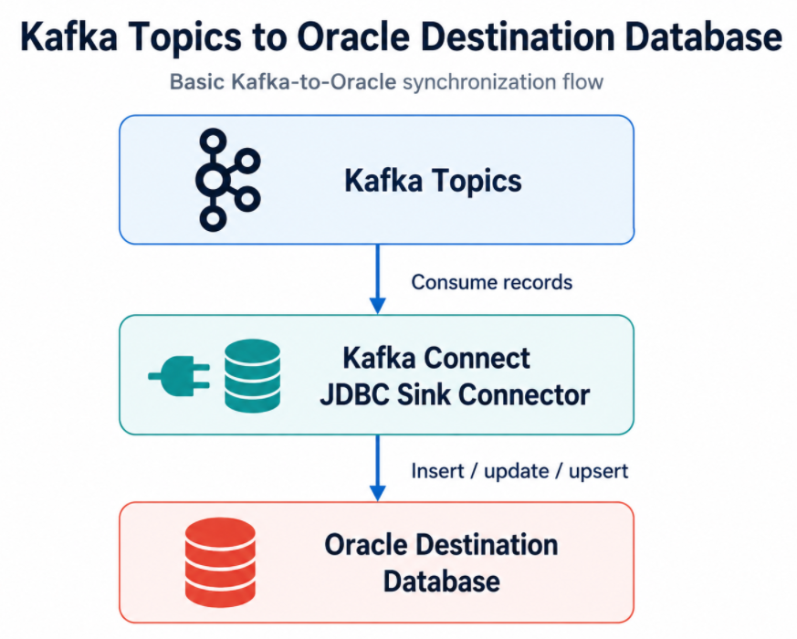
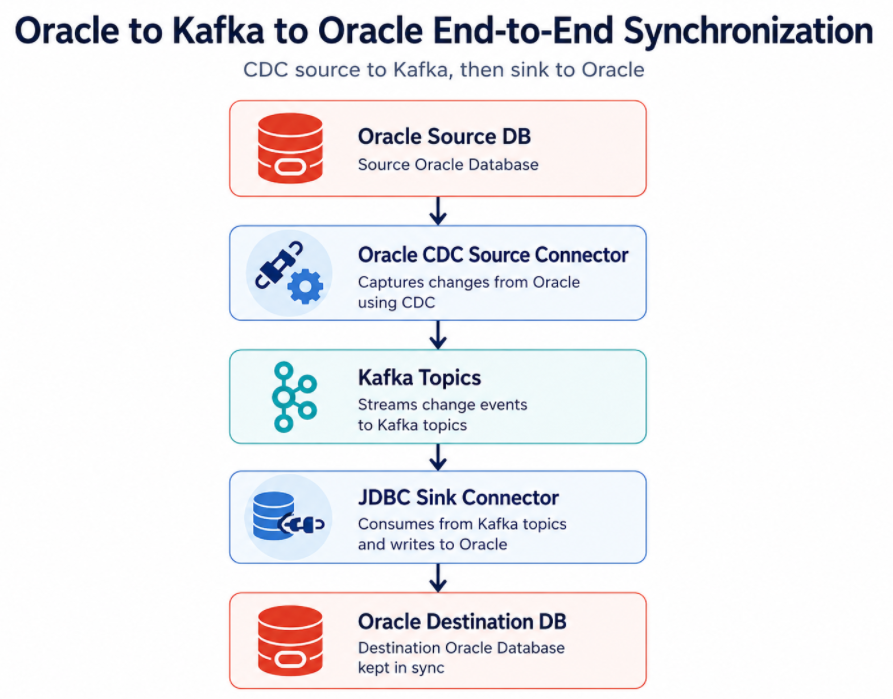
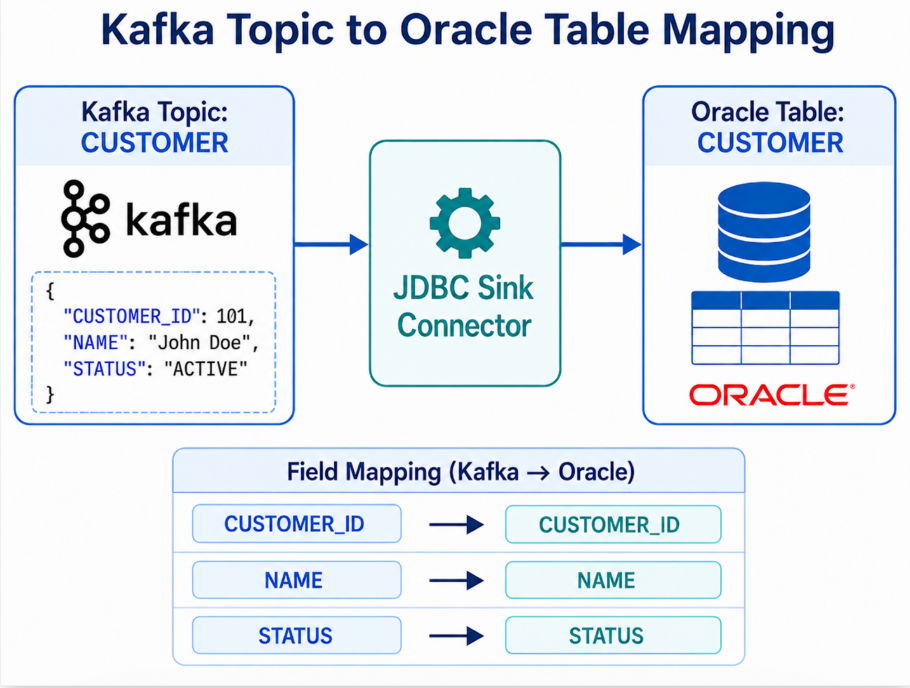
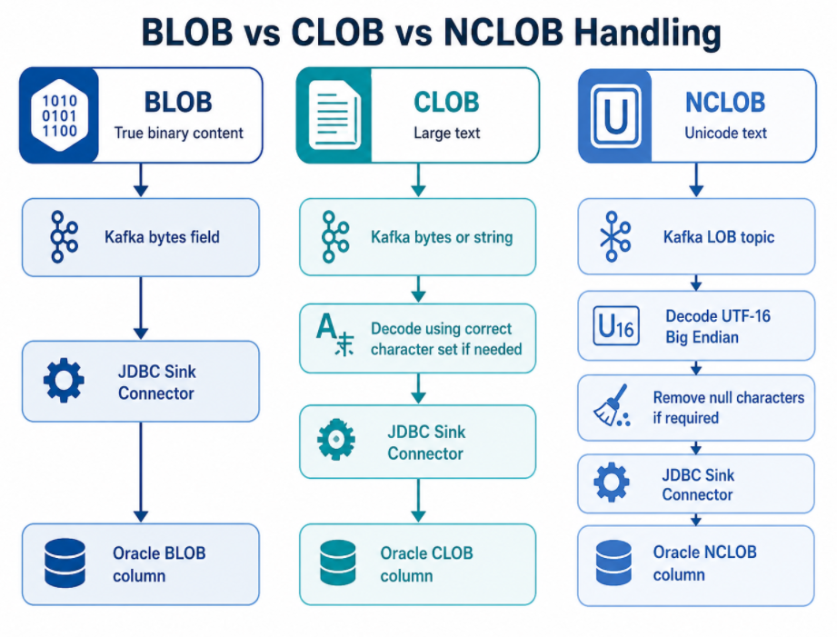
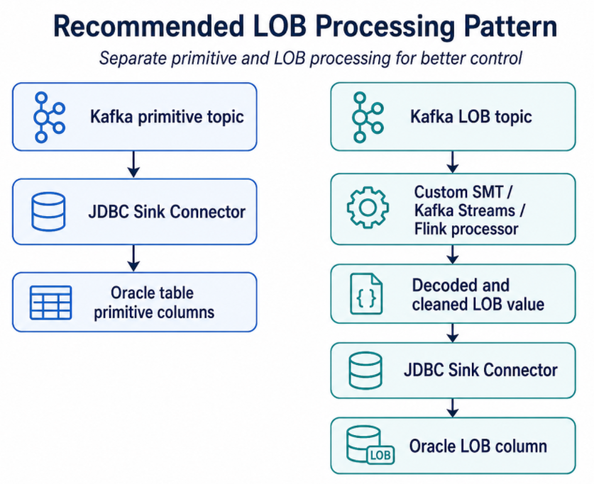
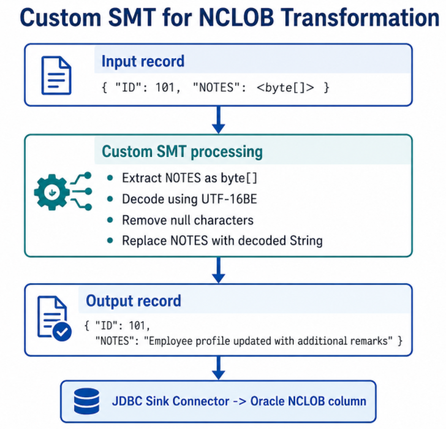
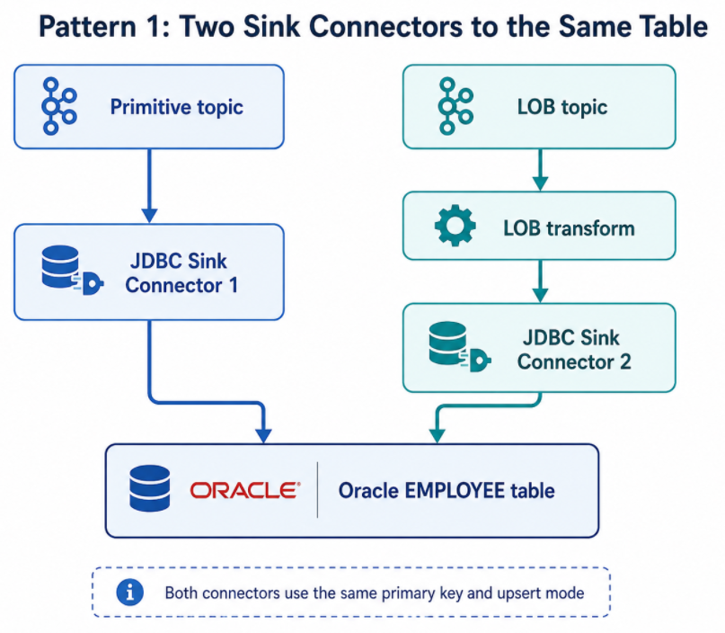
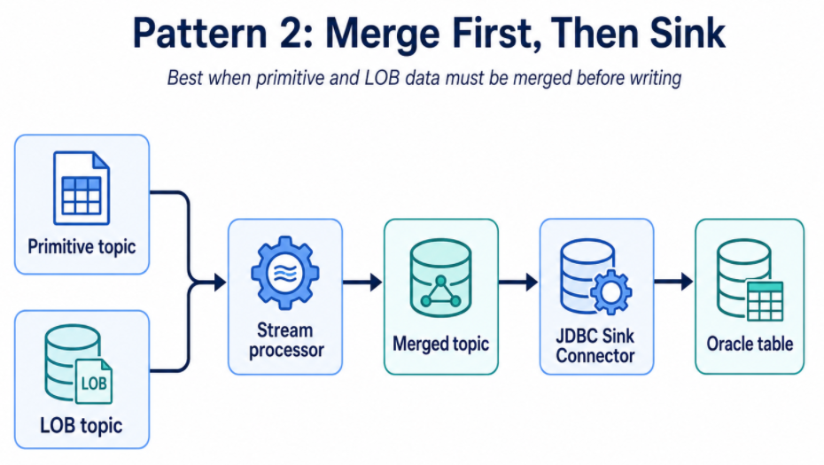
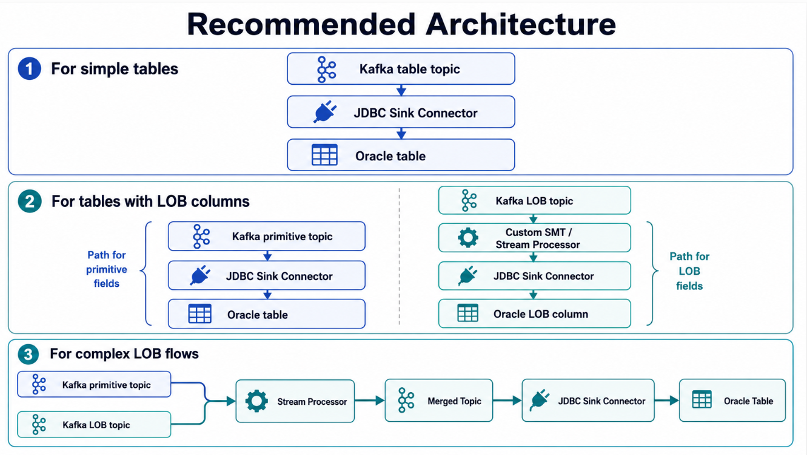

## Introduction

In many data streaming projects, the first milestone is to capture data from a source system and publish it into Kafka. But the data movement story often does not stop there. Once data is available in Kafka topics, downstream systems need to consume it. One common requirement is to synchronize data from Kafka topics into an Oracle database. This may be required for operational reporting, downstream application integration, database modernization, audit stores, or cross-zone database synchronization.

At first, this sounds simple:


&emsp;&emsp;**Kafka Topic --> JDBC Sink Connector --> Oracle Database**

For simple data types such as `VARCHAR2`, `NUMBER`, `DATE`, and `TIMESTAMP`, this is usually straightforward if the Kafka record schema, primary key strategy, and destination table are designed properly.

However, the challenge increases when Kafka topics contain LOB data such as `BLOB`, `CLOB`, `NCLOB`. LOB data may arrive as bytes, Base64-encoded content, or binary Avro payloads, depending on the converter and source connector behavior. If the destination Oracle table expects a readable `CLOB` or `NCLOB`, the pipeline may need transformation before the JDBC Sink Connector writes the data.

This blog focuses on the Kafka-to-Oracle side of the pipeline: how to write Kafka records into Oracle using the Confluent JDBC Sink Connector and how to handle LOB columns safely.


## The Use Case

The high-level requirement is to synchronize data from Kafka topics into Oracle tables.




In a CDC-based architecture, these Kafka topics may have been produced by an upstream CDC source connector. For example:




This blog focuses only on the second half: **Kafka Topics --> Oracle Destination DB**


The important question is: How do we correctly map Kafka records into Oracle table rows, especially when LOB columns are involved?


## Why Use JDBC Sink Connector?

The JDBC Sink Connector is commonly used when Kafka topic records need to be written into relational databases.

It provides a standard Kafka Connect based mechanism for:


* Consuming Kafka records
* Mapping record fields to database columns
* Inserting rows
* Updating rows
* Performing upserts
* Managing retries
* Handling errors
* Using Single Message Transforms
* Integrating with schema-aware converters


Instead of writing a custom Kafka consumer application for every database synchronization requirement, the JDBC Sink Connector provides a reusable integration pattern.


## Basic Kafka-to-Oracle Flow

For a simple Kafka topic containing customer data, the flow may look like this:




Destination Oracle table:

```sql
CREATE TABLE CUSTOMER (
    CUSTOMER_ID NUMBER PRIMARY KEY,
    NAME        VARCHAR2(100),
    STATUS      VARCHAR2(20)
);
```

For this type of record, the sink connector can map fields directly to columns.

Conceptually:

```text
Kafka field CUSTOMER_ID  -> Oracle column CUSTOMER_ID
Kafka field NAME         -> Oracle column NAME
Kafka field STATUS       -> Oracle column STATUS
```


## INSERT, UPDATE and UPSERT

One of the most important design decisions is how records should be written into Oracle.

Common modes are:


* Insert
* Update
* Upsert


### Insert Mode

`insert` mode is useful when every Kafka record represents a new row.

Example:

```properties
insert.mode=insert
```

This is simple, but it can fail if a row with the same primary key already exists.

### Update Mode

`update` mode is useful when rows already exist in the destination table and Kafka records should update those rows.

Example:

```properties
insert.mode=update
```

This requires the destination row to already exist.

### Upsert Mode

`upsert` mode is usually preferred for synchronization use cases.

Example:

```properties
insert.mode=upsert
```

In this mode:

```text
If the row exists    -> Update it
If the row is absent -> Insert it
```

For database synchronization, this is often the most practical behavior.

## Primary Key Handling

Upsert requires a reliable primary key.

The JDBC Sink Connector needs to know which field or fields identify the destination row.

Example Oracle table:

```sql
CREATE TABLE CUSTOMER (
    CUSTOMER_ID NUMBER PRIMARY KEY,
    NAME        VARCHAR2(100),
    STATUS      VARCHAR2(20)
);
```

The Kafka record must either have the primary key in the key or in the value.

Example where primary key is in value:

```json
{
  "CUSTOMER_ID": 101,
  "NAME": "John Doe",
  "STATUS": "ACTIVE"
}
```

Typical connector configuration pattern:

```properties
insert.mode=upsert
pk.mode=record_value
pk.fields=CUSTOMER_ID
```

This tells the sink connector to use the `CUSTOMER_ID` field from the Kafka record value as the primary key.

Without correct key handling, the connector may not be able to update existing rows reliably.


## Auto-Create Table vs Pre-Created Oracle Table

The JDBC Sink Connector can create tables automatically in some cases if `auto.create=true` is configured.

However, for Oracle production workloads, especially where LOB columns are involved, it is usually better to pre-create the destination table.

Reasons:


* You can control exact Oracle data types
* You can define primary keys explicitly
* You can choose CLOB vs NCLOB vs BLOB correctly
* You can define indexes and constraints properly
* You can avoid incorrect type inference
* You can align storage, tablespace, and LOB segment settings


For example, if the Kafka field is represented as bytes, automatic table creation may not infer the desired Oracle `NCLOB` type. You may need the destination column to be explicitly defined.

Example:

```sql
CREATE TABLE EMPLOYEE (
    ID          NUMBER PRIMARY KEY,
    NAME        VARCHAR2(100),
    UPDATED_AT  TIMESTAMP,
    NOTES       NCLOB
);
```

In this case, you want the sink pipeline to write decoded text into `NOTES`, not raw bytes.


## Kafka Connect Type to Oracle Column Mapping

Before deploying the sink connector, review how Kafka Connect field types should map to Oracle columns.

A practical mapping table:

```text
Kafka Connect Type         Suggested Oracle Type               Notes
---------------------      -------------------------           -----------------------
String                     VARCHAR2 / CLOB / NCLOB             Depends on size and encoding
Int8 / Int16 / Int32       NUMBER                              Validate range
Int64                      NUMBER                              Validate range
Float32 / Float64          FLOAT / BINARY_FLOAT / NUMBER       Depends on precision need
Decimal                    NUMBER(p,s)                         Validate precision and scale
Boolean                    NUMBER(1) or CHAR(1)                Oracle has no native boolean column in SQL tables
Date                       DATE                                Confirm date semantics
Timestamp                  TIMESTAMP                           Confirm timezone requirements
Bytes                      RAW / BLOB / CLOB / NCLOB           Depends on actual payload meaning
```

The most important row is `Bytes`.

A Kafka `Bytes` field does not automatically tell you whether the data is:

```text
Binary file content
UTF-8 encoded text
UTF-16 encoded NCLOB text
Base64-encoded JSON representation
XML payload
Compressed binary content
```

You must know what the bytes represent before writing them into Oracle.


## Primitive Column Handling

For primitive columns, the Kafka-to-Oracle flow is usually straightforward.

Example Kafka record:

```json
{
  "ID": 101,
  "NAME": "John Doe",
  "AMOUNT": 2500.75,
  "CREATED_AT": "2026-07-10T10:15:30"
}
```

Destination Oracle table:

```sql
CREATE TABLE PAYMENT_EVENT (
    ID          NUMBER PRIMARY KEY,
    NAME        VARCHAR2(100),
    AMOUNT      NUMBER(12,2),
    CREATED_AT  TIMESTAMP
);
```

The main checks are:

```text
- Does the Kafka field name match the Oracle column name?
- Does the data type match?
- Is precision and scale correct for NUMBER columns?
- Is timestamp precision acceptable?
- Are nullable fields handled correctly?
- Is the primary key available?
```


## Why LOB Columns Need Special Handling

LOB stands for **Large Object**.

Oracle supports:

```text
BLOB   -> Binary Large Object
CLOB   -> Character Large Object
NCLOB  -> Unicode / national character large object
```

LOB columns are used for:

```text
- Large text
- XML
- JSON
- Documents
- PDF files
- Images
- Binary payloads
- Application notes or comments
```

From a sink perspective, the issue is not only size. The bigger issue is representation.

A Kafka topic may contain LOB data as:

```text
- Raw bytes
- Avro bytes
- Base64-encoded JSON string
- UTF-16 byte array
- UTF-8 text
- Nested structure containing LOB metadata and payload
```

Before writing into Oracle, you need to answer:

```text
- Is this payload binary or text?
- If text, what encoding is used?
- Should the destination column be CLOB or NCLOB?
- Does the value need decoding?
- Does the value contain null characters?
- Does the sink connector receive the final value in the correct field?
```


## BLOB vs CLOB vs NCLOB Handling



### BLOB

`BLOB` is binary data. If the Kafka field is truly binary content, it can remain as bytes.

Example use cases:

```text
PDF
Image
Compressed file
Binary document
```

Typical handling:

```text
Kafka bytes field --> JDBC Sink Connector --> Oracle BLOB column
```

For BLOBs, do not try to decode the bytes as a string unless you are certain the bytes represent text.


### CLOB

`CLOB` is character data. It is used for large text based on the Oracle database character set.

Example use cases:

```text
- Large text
- JSON document
- XML document
- Application notes
```

If Kafka already contains the value as a string, the JDBC Sink Connector may be able to write it directly to a `CLOB` column.

But if Kafka contains the value as bytes, you need to decode it into a string first.

Typical handling:

```text
Kafka bytes field --> Decode using correct character set --> String value --> Oracle CLOB column
```


### NCLOB

`NCLOB` is used for Unicode national character data.

In Oracle, `NCLOB` commonly uses `AL16UTF16`, which corresponds to UTF-16 Big Endian.

If the Kafka topic contains raw `NCLOB` bytes, the sink pipeline may need to decode those bytes using UTF-16 Big Endian before writing to Oracle.

Typical handling:

```text
Kafka LOB topic --> Read byte[] --> Decode UTF-16 Big Endian to String --> Remove null characters if required --> Write String to Oracle NCLOB column
```


## Example: Kafka Topic to Oracle Table with NCLOB

Destination Oracle table:

```sql
CREATE TABLE EMPLOYEE (
    ID          NUMBER PRIMARY KEY,
    NAME        VARCHAR2(100),
    UPDATED_AT  TIMESTAMP,
    NOTES       NCLOB
);
```

Primitive Kafka topic record:

```json
{
  "ID": 101,
  "NAME": "John Doe",
  "UPDATED_AT": "2026-07-10T10:15:30"
}
```

LOB Kafka topic record, conceptually:

```json
{
  "ID": 101,
  "NOTES": "<bytes representing UTF-16 encoded NCLOB content>"
}
```

The primitive fields can be written directly.

The `NOTES` field needs special handling:

```text
NOTES bytes
    -> decode UTF-16
    -> clean string
    -> write to Oracle NCLOB
```


## Recommended LOB Processing Pattern

A clean production pattern is to separate primitive and LOB processing.



This separation gives you better control and easier troubleshooting.


## Using SMTs for LOB Transformation



Kafka Connect Single Message Transforms, or SMTs, can modify records before they are written by the sink connector.

For LOB handling, a custom SMT may be used to:

```text
- Read raw byte[] field
- Decode bytes using UTF-16 Big Endian
- Remove null characters
- Trim or normalize text if required
- Move the decoded value into the expected field name
- Drop unnecessary metadata fields
- Prepare the record for JDBC Sink Connector
```

Conceptual example:

```text
Input record:
{
  "ID": 101,
  "NOTES": <byte[]>
}

Custom SMT processing:
- Extract NOTES as byte[]
- Decode using UTF-16BE
- Remove null characters
- Replace NOTES with decoded String

Output record:
{
  "ID": 101,
  "NOTES": "Employee profile updated with additional remarks"
}
```

After this, the JDBC Sink Connector sees `NOTES` as a string and can write it to the Oracle `NCLOB` column.


## When SMT Is Not Enough

SMTs are useful for simple record-level transformations. However, they are not always the best option.

Use Kafka Streams, Flink, or another stream processor when you need:

```text
Join primitive topic and LOB topic
Maintain state
Handle ordering between primitive and LOB events
Perform complex enrichment
Merge multiple LOB columns into one output record
Validate or repair records
Handle multi-step transformation logic
```

For example, if primitive data and LOB data arrive in separate Kafka topics and need to be merged before writing to Oracle, a stream processing application may be more suitable than an SMT.


## Handling Separate LOB Topics

In some CDC flows, primitive columns and LOB columns are published into separate topics.

Example:

```text
Primitive topic:
ORCL.ADMIN.EMPLOYEE

LOB topic:
EMPLOYEE-NOTES-lob
```

There are two common sink patterns.

### Pattern 1: Two Sink Connectors to the Same Table



Both sink connectors use the same primary key and `upsert` mode.

This pattern works when the primitive and LOB updates can be applied independently.

### Pattern 2: Merge First, Then Sink



This pattern is better when the destination row must be written as a complete merged record.


## JDBC Sink Connector Configuration Example

A simplified JDBC Sink Connector configuration for primitive data may look like this:

```json
{
  "name": "oracle-employee-sink",
  "config": {
    "connector.class": "io.confluent.connect.jdbc.JdbcSinkConnector",
    "tasks.max": "1",
    "topics": "ORCL.ADMIN.EMPLOYEE",
    "connection.url": "jdbc:oracle:thin:@//oracle-host:1521/ORCLPDB1",
    "connection.user": "DEST_USER",
    "connection.password": "********",
    "insert.mode": "upsert",
    "pk.mode": "record_value",
    "pk.fields": "ID",
    "table.name.format": "EMPLOYEE",
    "auto.create": "false",
    "auto.evolve": "false"
  }
}
```

For LOB data, the connector may need a transform before writing:

```json
{
  "name": "oracle-employee-notes-lob-sink",
  "config": {
    "connector.class": "io.confluent.connect.jdbc.JdbcSinkConnector",
    "tasks.max": "1",
    "topics": "EMPLOYEE-NOTES-lob",
    "connection.url": "jdbc:oracle:thin:@//oracle-host:1521/ORCLPDB1",
    "connection.user": "DEST_USER",
    "connection.password": "********",
    "insert.mode": "upsert",
    "pk.mode": "record_value",
    "pk.fields": "ID",
    "table.name.format": "EMPLOYEE",
    "auto.create": "false",
    "auto.evolve": "false",
    "transforms": "DecodeNclob",
    "transforms.DecodeNclob.type": "com.example.kafka.connect.transforms.Utf16BytesToString$Value",
    "transforms.DecodeNclob.field": "NOTES"
  }
}
```

The transform class above is only an example. In a real implementation, the custom SMT must be written, packaged, deployed to the Kafka Connect plugin path, and tested.


## Error Handling and DLQ

LOB processing can fail due to bad bytes, unexpected encoding, null values, unsupported payload structure, or destination column constraints.

A production sink connector should have clear error handling.

Recommended considerations:

```text
Enable error tolerance only when appropriate
Route failed records to a DLQ
Capture error context and headers
Log transformation errors clearly
Monitor DLQ topic
Create replay procedure for corrected records
Do not silently skip failed LOB records
```

Example configuration pattern:

```properties
errors.tolerance=all
errors.deadletterqueue.topic.name=oracle-employee-sink-dlq
errors.deadletterqueue.context.headers.enable=true
errors.log.enable=true
errors.log.include.messages=true
```

Use this carefully. `errors.tolerance=all` should not become a way to hide data loss. It should be paired with monitoring and alerting.


## Testing Strategy

Testing Kafka-to-Oracle synchronization should include more than one happy-path record.

### Test Primitive Data

Validate:

```text
Insert
Update
Upsert
Null values
Decimal precision
Timestamp precision
Primary key mapping
Column name mapping
```

### Test LOB Data

Validate:

```text
Small LOB values
Large LOB values
Null LOB values
Unicode characters
Special characters
Multi-byte characters
LOB updates
LOB deletes or nullification
Very large payloads
Invalid byte sequences
```

### Test Operational Scenarios

Validate:

```text
Connector restart
Task failure and recovery
DLQ handling
Duplicate record processing
Out-of-order primitive and LOB events
Destination database outage
Network failure
Schema evolution
```

---

## Common Mistakes to Avoid

### Mistake 1: Relying on Auto-Create for Oracle LOB Tables

Auto-created tables may not use the exact Oracle types you need.

For LOB workloads, pre-create destination tables.


### Mistake 2: Treating Bytes as Text Without Decoding

If Kafka contains `byte[]`, do not assume it is already a string.

Ask:

```text
What produced these bytes?
Are they binary or character data?
Which character set was used?
Should the target column be BLOB, CLOB, or NCLOB?
```


### Mistake 3: Ignoring NCLOB Encoding

`NCLOB` values may require UTF-16 decoding. If you decode them incorrectly, the destination value may be corrupted.


### Mistake 4: Not Testing Large Values

A 20-character test string does not prove LOB handling works.

Test realistic LOB sizes.


### Mistake 5: Not Designing Key Strategy

For upsert into Oracle, the sink must know the primary key.

Always confirm:

```text
Kafka key or value contains the key
pk.mode is correct
pk.fields is correct
Destination table has matching primary key or unique constraint
```

## Recommended Pre-Implementation Checklist

Before deploying the Kafka-to-Oracle sink pipeline, review the following:

```text
1. Kafka topic name
2. Kafka record format
3. Key location: record key or record value
4. Destination Oracle schema and table
5. Primary key mapping
6. Insert/update/upsert behavior
7. Column name mapping
8. Kafka Connect type to Oracle type mapping
9. LOB column list
10. LOB encoding
11. Required SMTs or stream processing
12. Error handling and DLQ
13. Retry behavior
14. Connector restart behavior
15. Monitoring and alerting
```

For each table, create a mapping sheet like this:

```text
Kafka Field | Kafka Type | Oracle Column | Oracle Type | Transformation Required | Notes
------------|------------|---------------|-------------|-------------------------|------
ID          | Decimal    | ID            | NUMBER      | No                      | Primary key
NAME        | String     | NAME          | VARCHAR2    | No                      | -
UPDATED_AT  | Timestamp  | UPDATED_AT    | TIMESTAMP   | Validate precision      | -
NOTES       | Bytes      | NOTES         | NCLOB       | Decode UTF-16           | LOB
FILE_DATA   | Bytes      | FILE_DATA     | BLOB        | No if true binary       | Preserve bytes
```


## Recommended Architecture



Choose the pattern based on ordering requirements, merge requirements, and downstream consistency expectations.


## Lessons Learned

### 1. Kafka-to-Oracle Sync Is Not Just a Sink Connector Configuration

The connector is important, but the full design includes schema mapping, primary key strategy, converter behavior, destination table design, LOB handling, error handling, and operational monitoring.

### 2. Pre-Create Oracle Tables for Better Control

For production workloads, especially with LOB columns, pre-create Oracle tables instead of relying on automatic table creation.

### 3. LOB Data Must Be Understood Before Writing

A Kafka bytes field may represent binary data, UTF-8 text, UTF-16 text, XML, JSON, or another structure. The sink pipeline must know what the payload means.

### 4. NCLOB Requires Encoding Awareness

If `NCLOB` data arrives as UTF-16 bytes, decode it correctly before writing it into Oracle as text.

### 5. Separate Primitive and LOB Handling When Required

Trying to force all columns through one generic pipeline can make troubleshooting difficult. Separate primitive and LOB handling gives better control.


## Conclusion

Synchronizing data from Kafka topics into Oracle using the JDBC Sink Connector is a powerful and reusable pattern. For simple relational columns, the flow is usually straightforward: map Kafka fields to Oracle columns, define primary key handling, choose insert/update/upsert behavior, and write records to the destination table.

LOB columns require more careful design.

`BLOB`, `CLOB`, `NCLOB`, and `XMLTYPE` should not be treated as ordinary fields without understanding their representation in Kafka. A bytes field may need to remain binary for a `BLOB`, or it may need to be decoded into a string for a `CLOB` or `NCLOB`. For `NCLOB`, UTF-16 decoding may be required before writing into Oracle.

A reliable Kafka-to-Oracle synchronization pipeline should therefore include:

```text
Correct topic-to-table mapping
Reliable primary key strategy
Explicit Oracle destination table design
Data type review
LOB-specific transformation where needed
DLQ and error handling
Operational monitoring
Realistic testing with production-like data
```

In short, the JDBC Sink Connector can move the data, but the pipeline design must preserve the meaning of the data. This is especially true for LOB columns, where correct encoding, transformation, and destination column design make the difference between a working synchronization pipeline and silent data corruption.


